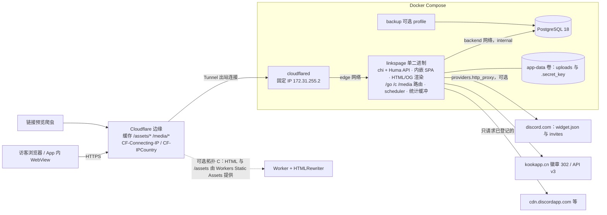

# LinksPage 技术选型

> **日期：** 2026-10-05　**状态：** 草案 v1.2（Q1–Q6 均已确认）　**仓库：** `github.com/Nanako1900/linksPage`
>
> - 版本号来自各专项调研当日查询的 npm、proxy.golang.org、Docker Hub、GitHub releases。标 **UNVERIFIED** 的内容还没有一手来源，实现前要先做 spike。
> - 本版已吸收三份对抗性评审（安全与隐私、运维、产品与可定制性）的意见。被否决或部分采纳的条目附有理由，见文末附录。
> - **当日实测的事实：**
>   - Discord `widget.json` 不带 CORS 头，响应 `cache-control: public, max-age=300, s-maxage=300`；guild 不存在时返回 `{"code":10004}`。
>   - KOOK 徽章接口不需要鉴权，返回 302 跳到 `img.shields.io`。跳转 URL 的 `label` 参数里就有服务器名，或者 `在线/总人数`。
>   - Compose v5.1.3 中，`.env` 里「空值后面跟行内注释」的写法会被解析成注释文本本身。
>   - Workers 可以配置不绑定 Worker 的路由（None route）；对静态资源的请求免费且不限量。
>   - cloudflared 支持 `--token-file`。

---

## 1. 项目定位与范围

运营者往往同时有 Discord 服务器、KOOK 服务器、QQ 群、微信群、Telegram 等多个社区。LinksPage 把它们汇总到**一个可分享的页面**上，实时显示名称、图标、在线人数和总人数、频道和在线成员，并提供「加入」入口。

基本原则：
- 访客**永远不需要登录**。
- 管理员有两种登录方式：OAuth2/OIDC，或本站用户名密码。管理员账号、角色和 OAuth 管理员列表**全部写在配置文件里**，后台不管理管理员（Q4）。
- 所有个性化内容都能在后台修改。
- 项目开源，以 Docker Compose 自托管为主，前面挂 Cloudflare。

| 范围 | 内容 |
|---|---|
| **MVP（M0–M3）** | - 单实例单页面（schema 已建 `pages` 表）<br>- **Discord**：widget.json 加 invite 计数<br>- **KOOK 免 token 模式**：解析官方徽章，拿到名称、在线人数、总人数<br>- **QQ 群卡片**（群号一键复制、可选加群链接和二维码）、**微信群卡片**（长按识别的二维码、说明文字、兜底联系方式）；Telegram 等静态卡片<br>- 微信 / QQ 内点 Discord 时显示「在浏览器打开」引导；手机端「在电脑上打开」<br>- Discord 官方 iframe，点击后才加载<br>- 内容块：链接、社交图标行、分组标题、文本<br>- 单社区分享页 `/c/{slug}`<br>- 管理后台；管理员（本地账号、OAuth）全部写在 config.yaml<br>- 内置无追踪统计；Webhook 通知<br>- zh-CN 和 en，可扩展其他语言<br>- Docker Compose 加 Cloudflare |
| **后续（M4–M5 及可选）** | - KOOK Bot Token 增强：图标、频道<br>- 可选：分享海报；微信群活码轮换、过期提醒和活码 webhook；数据驱动的 App 内行为矩阵（按社区覆盖）、大陆访客网络提示与替代入口<br>- presence 采样曲线<br>- 另外两套视觉预设<br>- TOTP、自定义 CSS<br>- 第三方统计预设、S3/R2、Prometheus<br>- 上传 CJK 字体并切片<br>- 多页面 UI |
| **明确不做** | 多租户 SaaS、访客账号、跨日回访或会话路径分析、微信 JS-SDK 卡片（需要公众号和备案）、任意自定义 `<head>` HTML |

---

## 2. 总体架构



**统计数据流：**
- `pageview`、`invite_copy`、`qr_open`：浏览器用 `sendBeacon` 发到同源的 `/api/e`。
- `join_click`、`outbound`：服务端在 `/go/{slug}` 中计数。
- `preview`：服务端渲染 HTML 时识别出爬虫，记一次。
- 所有事件进入内存 channel（容量 10k），每 2 秒或满 500 条用 `CopyFrom` 写入 `analytics_event`（v1 是普通表，不分区）。
- 每 5 分钟检查 watermark：有新事件时，才幂等地重算 `stats_hourly` 和 `stats_daily_dim`。

### 部署拓扑

用户原话是「前端 cloudflare 反代后端地址」，有两种读法。业主已确认 Q1 = (c)，架构**两种都支持**：Go 二进制始终内嵌 SPA，单靠 Compose 就能完整运行。

| 拓扑 | 说明 | 定位 |
|---|---|---|
| **B. Tunnel（README 默认）** | - `cloudflared` 在 compose 中运行，宿主机**不开放任何入站端口**，家宽、NAT、CGNAT 都能用<br>- Go 同时提供 HTML、SPA 和 API，天然同源<br>- 带哈希的资源和上传的图片在 CF 边缘长期缓存 | 自托管者零额外依赖 |
| **C. 边缘前端（Workers Static Assets）** | - Worker 绑定 `links.example.com/*`，HTML 和 `/assets/*` 由 Static Assets 提供<br>- Worker 用 HTMLRewriter 注入 OG、主题和数据，数据来自源站 `/api/v1/public/render`，缓存 60 秒<br>- `/api/*`、`/go/*`、`/c/*`、`/media/*`、`/healthz` 配成**不绑定 Worker 的 None 路由**，直接回源（同一主机名，经 Tunnel 或橙云），因此真实 IP 不受影响 | **前端真正托管在 Cloudflare**。Q1 已选 (c)，M1 作为一等拓扑交付，并纳入 CI |
| A. 直连橙云 | VPS 用已有的 Caddy、Nginx、1Panel 终止 TLS（Origin CA，Full strict），再反代到 `127.0.0.1:8080`；也可以用内置 TLS，见 12.3 | 适合已经有反代的用户 |

**C 的成本（已更正初稿）：** 静态资源请求免费且不限量，只有 HTML 请求会调用 Worker，每个 PV 大约 1 次。免费套餐每天 10 万次请求，约等于 10 万 PV/天。API、跳转和图片走 None 路由，不计入额度。

C 的代价：
- 需要两次部署（镜像和 `wrangler deploy`），由 release 用同一个 tag 产出 `web-dist.tar.gz` 来保证版本一致。
- `preview` 计数改由 Worker 用 `ctx.waitUntil` 补发到 `/api/e`，并带上共享密钥 `X-LP-Proxy-Auth`。
- 免费额度用完后，`run_worker_first` 匹配的请求会直接返回 429。
- 绑定 `*.workers.dev` 或 `*.pages.dev` 在大陆不可用，必须用自定义域名。

**应用侧约定（A、B、C 通用）：**
- 前端只用相对路径。
- 所有绝对 URL 只由 `base_url` 生成，不读取 `Host` 或 `X-Forwarded-*`。
- 客户端 IP 采用显式信任模型，见 4.9。
- 统计只走不可缓存的端点。

---

## 3. 技术栈总表

### 3.1 后端与基础设施

| 层 | 选择 | 版本 | 理由 | 落选方案 |
|---|---|---|---|---|
| 语言 | Go | go.mod 写 `go 1.26.0`；镜像用 `golang:1.27-alpine`（1.27.1） | 本地的 1.26.3 能构建；goose v3.28 要求 Go ≥1.26；CI 同时测 1.26.x 和 1.27.x | — |
| 数据库 | PostgreSQL | `postgres:18-alpine`（18.6） | 原生 `uuidv7()`。PG 19 预计 2026-10-29 GA，发布几个小版本后再升 | PG 19 |
| HTTP / OpenAPI | Huma v2，底层 chi v5（`humachi`） | huma **≥ v2.39.1**；chi v5.3.2 | 代码优先生成 OpenAPI 3.1，默认 RFC 9457 错误格式。v2.39.0 的中间件拿到的 status 是 0，所以最低 v2.39.1 | stdlib 加 humago；echo、gin、fiber；oapi-codegen、ogen |
| DB 访问 | pgx v5（pgxpool）加 sqlc | pgx v5.11.0（**≥ v5.9.2**，修复 GHSA-j88v-2chj-qfwx）；sqlc v1.31.1 | 原生 SQL，编译期检查；sqlc 直接读 goose 迁移 | GORM、ent、bun |
| 迁移 | goose v3 Provider API，迁移文件嵌入二进制 | v3.28.0 | 有 SessionLocker；支持 Go 函数写迁移 | golang-migrate、Atlas |
| 配置 | koanf v2 | v2.3.7 | 保留 key 的大小写，模块化 | Viper、cleanenv |
| 日志 | `log/slog` 加 httplog v3 | v3.5.0 | 公开路由用 `Skip` 跳过，改用极简 access log（见 4.12） | — |
| 限流 | go-chi/httprate 的 `LimitBy` | v0.16.0 | 以可信 IP 为 key，IPv6 按 /64 归桶 | x/time/rate 手写 |
| 后台任务 | `time.Ticker` 加 errgroup，再加 PG advisory lock | stdlib | 大约 6 个幂等的周期任务 | River、gocron |
| 缓存 | `atomic.Pointer[PublicPage]`；按 key 缓存用 `hashicorp/golang-lru/v2/expirable` 加 `x/sync/singleflight` | lru v2.0.7（M0 锁定） | 依赖面小；go-oidc 自己会缓存 JWKS | otter v2（评审认为只为两处小缓存不值得）、Redis |
| 上传存储 | `Storage` 接口，默认本地卷 | — | 文件按内容寻址，可设 immutable 缓存。S3（minio-go）到 M5 才加入 go.mod | — |
| 图片处理 | `x/image/draw` 加 gen2brain/webp（纯 Go，构建时 `-tags nodynamic`） | x/image v0.46.0；webp v0.6.4 | 不需要 CGo，可以用 distroless static 镜像 | govips、imaging、nativewebp |
| Markdown | goldmark（不开 unsafe）加 bluemonday UGCPolicy | M0 锁定 | 隐私页、简介、页脚只允许 Markdown 子集 | 允许任意 HTML |
| OAuth/OIDC | 在 go-oidc 和 x/oauth2 之上自写薄封装 | go-oidc v3.21.0；x/oauth2 v0.37.0 | 约 500 行，便于审计；PKCE 和 nonce 自己校验 | zitadel/oidc、goth、authboss |
| 密码 / 2FA | argon2id（x/crypto，OWASP 参数 m=46MiB、t=1、p=1）；TOTP 用 pquerna/otp | x/crypto v0.57.0；otp v1.5.0 | 单 vCPU 上 p=4 没有收益；配合内存信号量（4.11） | bcrypt |
| UA 解析 | medama-io/go-useragent，加 vendor 进仓库的 isbot 列表 | v1.2.5；isbot v5.2.2（Unlicense） | 快，仍在维护 | mileusna（停更）、uap-go |
| 地理位置 | `CF-IPCountry`；备选 DB-IP Country Lite | geoip2-golang v2.4.0 | CC BY 4.0，不需要注册 | MaxMind（可选）、IPinfo |
| 指标 | prometheus/client_golang（M5，默认关闭，单独端口） | v1.24.1 | 不经过 Cloudflare | — |
| 运行镜像 | `gcr.io/distroless/static-debian13:nonroot` | 已 inspect | 约 2 MiB，以 UID 65532 运行 | alpine |
| 隧道 | cloudflared | `cloudflare/cloudflared:2026.9.3` | 支持 `--token-file` | — |

### 3.2 前端

| 层 | 选择 | 版本 | 理由 | 落选方案 |
|---|---|---|---|---|
| 框架 | React | 19.3.0 | `<ViewTransition>` 已稳定 | Preact |
| 构建 | Vite 加 @vitejs/plugin-react | 8.3.2 / 6.1.2 | Rolldown；多入口；`build.manifest` | — |
| 样式 | Tailwind CSS 加 @tailwindcss/vite | 4.3.3 | `@theme inline` 映射到运行时变量 | CSS-in-JS |
| 语言 | TypeScript | 7.0.2 | 只用于 `tsc -b --noEmit`。7.0 没有 JS compiler API，也不支持 `baseUrl`。必要时回退到 `@typescript/typescript6` | — |
| 包管理 | pnpm | `packageManager` 锁定 11.28.x（本地 9 需要升级） | 支持 `allowBuilds`，有发布冷却期 | — |
| Node | 构建镜像用 `node:24-alpine` 加 corepack | 24.21 LTS | Vite 8 要求 ≥22.12；orval 要求 ≥22.18 | — |
| 后台路由 | TanStack Router | 1.170.41 | 类型化的 search params | React Router |
| 数据请求 | TanStack Query（只在后台用） | 5.104.1 | — | SWR |
| API 客户端 | orval | 8.40.0 | 不依赖 TS compiler API | openapi-typescript（peer 依赖 TS 5） |
| 表单 | React Hook Form 加 zod | 7.89.0 / 4.6.5 | — | TanStack Form |
| 后台组件 | shadcn/ui CLI 4，基于 Base UI | 4.21.1；@base-ui/react 1.8.0 | — | 基于 Radix 的版本 |
| 取色器 | 原生 `<input type="color">` 加 OKLCH 文本输入，用 culori 计算 | culori 4.0.2 | 不为一个控件引入 react-aria-components | react-aria-components |
| 图标 | lucide-react 加 simple-icons | 1.52.0 / 16.34.0 | simple-icons **没有 KOOK** | react-icons |
| 拖拽排序 | @dnd-kit/react（精确锁定），另配上移/下移按钮 | 0.5.0 | 支持触屏 | pragmatic-drag-and-drop |
| 图表 | shadcn `chart`（Recharts） | recharts 3.10.1 | 只在后台懒加载。CSP 见 12.4 | visx、ECharts |
| 二维码 | uqr（动态 import），用 canvas 输出 **PNG ``** | 0.1.3 | 微信和 QQ 的长按识别只对图片有效 | 内联 SVG |
| Markdown（前端） | markdown-to-jsx，开启 `disableParsingRawHTML` | M0 锁定 | 不使用 innerHTML | — |
| i18n | 公开页用自写 `t()`；后台用 i18next | 26.4.2 / 17.0.15 | 两边共用同一种 JSON 格式 | Paraglide、Lingui |
| 动效 | 公开页只用 CSS；后台用 tw-animate-css | — | 公开页零 JS 开销 | motion |
| 字体 | 默认系统字体栈；可选自托管 @fontsource-variable/* | 5.3.0 | Google Fonts 在大陆被墙 | Google Fonts |
| Lint / 格式化 | Biome | 2.5.15 | 一个工具覆盖 TS、JSON、CSS | ESLint 10、Oxlint |
| 测试 | Vitest、Testing Library、Playwright、axe | 5.0.3 / 16 / 1.63.0 / 4.13.0 | — | — |

### 3.3 关键裁决

| 议题 | 裁决 | 理由 |
|---|---|---|
| 公开页 CSP 用 nonce 还是 hash | **hash** | 每个请求一个 nonce，与 ETag/304 冲突：304 带来新 CSP，body 却是旧的，回访时样式和脚本会被拦。hash 下同一个 ETag 对应同一份 CSP |
| 外部图片代理 | **不透明 key：`/media/p/{key}.{ext}`** | 只代理快照中登记过的 URL，不是开放代理。带扩展名，CF 默认就会缓存 |
| 统计表结构 | **v1 用普通表加 BRIN，每天分批 DELETE** | hobby 规模下，分区维护失败造成的风险大于收益 |
| 管理员身份与角色 | **只由 config.yaml 决定**（本地账号和 OAuth 都是），DB 不存管理员表 | 配置即真相，DB 无法授予或覆盖权限；没有首次引导和 setup token 的攻击面 |
| 身份键 | 本地 **`local:<username>`**；OAuth **(issuer, subject)** | OIDC 的 `sub` 只在同一 issuer 内唯一 |
| compose 用的变量 | 前缀 **`LINKSPAGE_*`**，app 的变量前缀 **`LP_*`**；不使用 `env_file` | 避免把整份 .env 注入 app，也避免和 koanf 的前缀冲突 |
| 密钥传递 | compose `secrets:` 加 `*_FILE` | 环境变量会出现在 `docker inspect` 里 |
| `/go` 超限时 | **从不返回 429**，只跳过计数 | 国内 CGNAT 后面大量用户共用一个出口 IP |
| 主题颜色 | **sRGB hex 作为基线，`@supports` 再覆盖为 oklch** | Chrome 111 以下和旧 Safari 不支持 oklch |
| `/media/p` 与 `/media/u` 前缀 | 两者统一放在 `/media/` 下 | 只要一条缓存规则，CSP 只需 `'self'` |
| SVG 上传 | **禁止** | 避免同源存储型 XSS。KOOK 徽章 SVG 也不代理 |
| 配置中的本地密码 | **只接受 argon2id PHC 哈希**，明文拒绝启动 | 配置文件常被备份、提交或截图；哈希由 `hash-password` 生成 |
| HTML 渲染 | Go 的 `html/template` 加 Vite manifest | 不依赖「Vite 是否保留 `{{…}}`」这个未核实的问题 |
| `secret_key` | 自动生成到 `/data/.secret_key`；各用途用 HKDF 派生子密钥；派生值带 kid | 自托管更友好，也有轮换路径 |

---

## 4. 后端设计要点

### 4.1 目录与分层

```
cmd/linkspage/main.go   # serve(默认) | migrate up|status | openapi | healthcheck | version
                        # hash-password | totp-secret(M5) | config check | admin list|unlock|revoke-sessions [--identity]
                        # settings export|import [--bundle] | analytics rebuild --since
internal/config/        # koanf 加载 + Validate()（errors.Join，fail fast）+ Secret 脱敏
internal/httpapi/       # chi 路由、huma 操作、problem 错误、中间件、按路由生成 CSP
internal/webui/         # //go:embed all:dist + manifest + html/template + OG/favicon 生成
internal/store/{migrations,queries,dbq}/
internal/provider/{discord,kook,static}/  platforms.yaml（平台预设数据）
internal/analytics/  internal/auth/  internal/media/  internal/jobs/  internal/notify/
internal/netx/          # IP 信任模型、CF IP 段、出站 client（按 provider 设置代理）
internal/content/       # Markdown 渲染与清洗、URL scheme 校验、文本清洗
```

### 4.2 路由（显式挂载，按顺序）

1. **`/api/*`**：Huma。未知路径返回 problem+json 404，**不回落到 HTML**。
2. **静态资源**：
   - `/assets/*`：embed FS。未命中返回 404，带 `no-store`。
   - `/fonts/*`、`/ext/*`。
   - `/favicon.ico`、`/robots.txt`、`/site.webmanifest`：根据 DB 动态生成。
3. **`/go/{slug}`**、`/media/u/*`、`/media/p/*`、`/media/q/*`、`/healthz`、`/readyz`。
4. **`/admin/*`**：后台 HTML。配置中没有任何管理员时，`/admin/login` 显示「未配置管理员」和一段可复制的 YAML 片段（见 6.2）。没有 `/setup` 路由。
5. **公开 HTML 只匹配 `/`、`/privacy`、`/c/{slug}`**。其他路径返回带兜底 markup、可定制的 **404 HTML**，状态码 404。

其他要点：
- 根 handler 外面包一层 `http.CrossOriginProtection`，并调用 `AddTrustedOrigin(base_url)`。
- 前端监听 `vite:preloadError`，触发时自动刷新一次，处理发版后旧 chunk 不存在的情况。
- `linkspage openapi` 导出 spec，CI 检查是否漂移。

### 4.3 数据库与迁移

**连接**
- pgxpool。密码用 `db.password_file` 读取，不需要做 URL 编码。
- 启动时 `ParseConfig` 失败就直接退出。

**迁移**
- goose 迁移嵌入二进制，启动时执行，使用 SessionLocker。也支持 `db.auto_migrate: false`，改由 `linkspage migrate up` 手动执行。
- 启动时打印将要执行的迁移版本。迁移完成前，`/readyz` 返回 503。
- **兼容规则：**
  - 同一个大版本内只做 expand 迁移：加表、加可空列、加索引。破坏性的 contract 迁移只在大版本升级时做。
  - schema 里记录 `min_compatible_app_version`。二进制版本只要不低于它就允许启动，所以可以回退到上一个小版本。
- goose v3.27 起，`DO $$` 和函数体需要手动加 `StatementBegin/End`。

**表结构与查询**
- 主键用 `uuidv7()`。
- sqlc 配置：`pgx/v5`、`emit_empty_slices`、`emit_pointers_for_null_types`。

### 4.4 配置优先级与归属

**加载优先级**（从低到高）：
1. 内置默认值
2. `/etc/linkspage/config.yaml`。挂载的是目录 `./config`；**只有 ENOENT** 按空配置处理，EACCES、YAML 解析错误等一律 fail fast，并提示 `chgrp 65532 config config/config.yaml secrets/admin_* && chmod 750 config && chmod 640 config/config.yaml secrets/admin_*`（init.sh 会自动执行）。config.yaml 含 `password_hash` 且其他用户可读（mode&0004）时打印 WARN。
3. `LP_*` 环境变量（`__` 表示嵌套）
4. `LP_*_FILE`

**启动校验（fail fast）：**
- 任何值以 `#` 开头，报错并指出变量名。这是为了防住 `.env` 行内注释的坑。
- `secret_key` 少于 32 字节。
- 代理 URL 无法解析。
- 本地账号出现明文 `password` 字段，或 `password_hash` 不是合法的 argon2id PHC 字符串：报错并提示运行 `docker compose run --rm --no-deps app hash-password`。
- `auth.*` 严格解码（mapstructure `ErrorUnused`），出现未知键（如拼错的 `passwd`）就报错；每个本地用户必须**恰好**有 `password_hash` 或 `password_hash_file` 之一。
- PHC 参数超出上限（m > 64 MiB、t > 5、p > 2）：拒绝启动，提示用 `hash-password` 重新生成，防止一次登录就把 384M 容器 OOM。
- `auth.*` 的校验错误只给出 key 路径（如 `auth.local.users[0].password`），不输出值。
- 管理员条目的 `role` 不是 `owner` 或 `editor`，或同一身份重复出现。
- 没有配置任何管理员时**不报错**，只打印 WARN（公开页照常可用，见 6.2）。
- 出现未知的 `LP_*` 键时只打印 WARN，并在「系统」页列出来。
- `linkspage config check` 执行同样的校验后退出，不启动服务、不连接数据库。

**归属原则：**
- 放在 file 或 env：会授予权限、可能把人锁在外面、需要重启才生效、会引入外部脚本来源或出站目标的配置，以及所有 secret。
- 其余所有个性化内容放在 DB，由后台编辑。
- 管理员账号、角色、OAuth provider **只在配置中**，DB 不存也不能覆盖。v1 不热加载配置，修改后需重启。

**导入导出：**
- 首次启动时可以用 `seed_file` 导入初始内容。seed.yaml 可引用相对 `config/` 的图片文件（头像、二维码等），导入时走 4.7 的处理流程写入 `media` 和 `community_qr_codes`。
- `linkspage settings export --bundle out.tar.gz` 打包 settings、blocks、communities（含二维码）、links、自定义平台，以及所有被引用的媒体文件，附带 sha256 manifest。导入时会重新校验并重新编码图片。后台也提供同样的入口，仅 owner 可用，并要求重新认证。

### 4.5 后台任务（leader 用 `pg_try_advisory_lock` 选举）

| 任务 | 周期 | 说明 |
|---|---|---|
| provider 刷新 | Discord widget 5 分钟；invite 15 分钟；KOOK 徽章 5 分钟 | 遵守 `Retry-After`；失败时沿用上次快照并标为 stale；连续失败时通知 |
| 统计 flush | 每 2 秒或满 500 条 | channel 满了就丢弃并计数 |
| rollup | 每 5 分钟，watermark 前进时才执行 | 重算今天；01:00 前同时重算昨天。用 `ON CONFLICT … DO UPDATE … WHERE (events, visitors) IS DISTINCT FROM excluded`，减少无效写入 |
| 保留期清理 | 每天 | `DELETE … WHERE ts < now() - retention`，每批 1 万行 |
| 可见性边界 | 定时器 | 到达最近的 `visible_from` 或 `visible_to` 时，重建公开 DTO（见 4.6） |
| 其他维护 | 每天或每小时 | salt 轮换后立即 `VACUUM analytics_salt`；刷新 CF IP 段；清理过期的 session 和 oauth_flow；回收无引用的媒体和代理登记；`bot_ua_sample` 只保留 5000 行（按 LRU） |

每次执行都包在 `runSafe` 中：recover、单次超时、slog 记录。

### 4.6 缓存

- **公开 DTO：** 组装好后放在 `atomic.Pointer[PublicPage]` 中，包含 CSP 所需的 hash。以下情况会重建：后台写入、provider 刷新、**到达 `next_boundary`**。`next_boundary` 是所有未来的可见性边界中最早的一个；非 leader 实例在读取时发现已过边界，也会自行重建。
- **ETag** 取 `hash(settings.version, 当前可见集合, 快照时间)`。渲染 HTML 时再按当前时间过滤一次，作为兜底。
- **按 key 缓存**（OIDC discovery、代理图片的小对象）：用 expirable LRU 加 singleflight，并按字节设上限。
- **不使用 Redis。**

### 4.7 上传与图片

**处理流程：**
1. `MaxBytesReader`，上限 5 MB。
2. `DetectContentType`，只接受 png、jpeg、webp。
3. `DecodeConfig`：边长不超过 **4096×4096**；**拒绝 16 位 PNG**，提示「请导出 8 位 PNG」。
4. 申请内存信号量（见 4.11）。
5. 解码，用 CatmullRom 缩放，重新编码，同时去掉 EXIF。

**输出格式：**
- 头像和背景：WebP（Q82），另存一份 PNG 作回退。
- OG 图：JPEG 1200×630。
- favicon：PNG，尺寸 32、180、192、512。

**存储与访问：**
- key 为 `sha256[:16].<ext>`，路径 `/media/u/{key}`，响应 `public, max-age=31536000, immutable`。本地存储通过 `os.OpenRoot` 访问。
- **二维码不走 `/media/u`**，改走 `/media/q/{qr_id}`，响应 `public, max-age=300`；替换或删除后返回 410。
- 可选配置 `cloudflare.purge_api_token_file`（只授予 Zone.Cache Purge 权限）。配置后，删除媒体时按 URL 清除 CF 缓存；没有配置时，后台的删除确认框提示「CDN 缓存最长保留一年」。
- **默认生成物：**
  - 没有上传 OG 图时，把头像居中放在主题背景色上，合成 1200×630，不渲染文字（不需要 CJK 字体）。没有宽图时输出 `twitter:card=summary`。
  - 没有上传 favicon 时，用头像生成；没有头像时，用强调色生成一个几何图形。

### 4.8 SPA 嵌入与 HTML/OG 注入

**嵌入。** Vite 开启 `build.manifest`，产物用 `//go:embed all:dist` 嵌入。保留 `dist/.gitkeep`，没有前端产物时也能 `go build`。

**每个请求注入的内容：**
- `<html lang data-preset data-appearance>`
- title、description、canonical、hreflang、`og:locale` 及其 alternate
- `og:*`、`twitter:*`、QQ 会读取的 `itemprop`
- theme-color、favicon、manifest
- `meta robots`（由 `search_indexing` 控制）
- 站长验证 meta（只接受白名单里的 name）

**内联内容与 CSP hash：**
- `<style id="lp-theme">`：由校验过的 token 生成。它的 hash 在 PublicPage 重建时计算。
- 首屏脚本：约 250 B，内容固定，启动时计算 hash。
- `<script id="lp-data" type="application/json">`：传入 Go struct，由模板负责转义。它不会被执行，不受 CSP 限制。
- `#root` 内的服务端兜底 markup，以及约 1.5 KB **不放在 layer 里、只用 hex 颜色**的关键 CSS，hash 在启动时计算。
- Go 模板中**禁止 `style=` 属性**，CI 用 grep 检查。React 的 style prop 走 CSSOM，不受影响。

**预览模式。** `/?preview=draft` 只在请求带有有效管理员会话时生效，否则按普通页面处理。生效时响应 `frame-ancestors 'self'` 和 `no-store`。

**缓存头：**
- HTML：`Cache-Control: no-cache, no-transform`，加 ETag。`no-transform` 用来阻止 CF 注入 Email Obfuscation 和 Web Analytics 脚本。
- 源站用 chi 的 `middleware.Compress` 自行压缩。
- `/assets/*`：`public, max-age=31536000, immutable`。

**开发模式与 C 拓扑。** 找不到 `#lp-data` 时，前端回退到请求 `/api/v1/public/bootstrap`。C 拓扑下由 Worker 调用 `/api/v1/public/render`，拿到 head 片段、数据和 CSP hash。

### 4.9 客户端 IP 信任模型

- `trusted_proxies` 可以是 CIDR 列表、`cloudflare`（内置 CF IP 段，每天刷新）、`dns:<服务名>`（启动时解析）或 `none`。
- **Tunnel 拓扑默认值是 `172.31.255.2/32`**，也就是 cloudflared 在固定子网 edge 网络中的地址。edge 用 `ip_range` 把动态分配限制在 `.8/29`，app 和 `docker compose run` 起的容器都拿不到 .2（见 12.1）。**不再信任整个 RFC1918。** 这样 Docker 网关（IPv6 docker-proxy 转发后显示的源地址）和同网络的其他容器都无法伪造 IP。
- 只有 `RemoteAddr` 可信时，才读取 `client_ip_header`（默认 `CF-Connecting-IP`）和 `CF-IPCountry`。
- **拓扑 A 前面有反代时**，使用 `client_ip_header: X-Forwarded-For` 加 `trusted_proxies: [<反代地址>, cloudflare]`，从右往左跳过可信代理。这样绕过 CF 的客户端无法伪造 IP。反代必须**追加**而不是覆盖 XFF。
- **禁止使用** chi 的 `RealIP` 和 `ClientIPFromHeader`，它们不检查 RemoteAddr。
- 运行时检测：来自可信代理的请求如果缺少 IP 头，打印 WARN；「系统」页显示「单一 IP 占比」。

### 4.10 错误与响应格式

- **成功：** `{"data": T, "meta"?: {...}}`。
- **错误：** RFC 9457 problem+json，扩展 `code`（稳定的错误码，同时作为 i18n key）和 `requestId`。
- 状态码 ≥500 时只返回 `{code:"internal"}`，原始 error 只写日志。
- 测试中不断言 JSON 错误文本，因为 Go 1.27 默认使用 json v2。

### 4.11 限流、内存与加固

| 端点 | 规则 |
|---|---|
| 公开读 API | 每 IP 每分钟 120 次，超限返回 429 |
| `/go/*` | **从不返回 429**。每 IP 每分钟超过 120 次时照常跳转，只跳过计数，并累加 `analytics_rate_limited_total` |
| `POST /api/e` | 每 IP 每分钟 60 次，超限**静默返回 204** 并丢弃；全局令牌桶每秒 200 条；body ≤ 2 KB |
| `/media/p/*` | 每 IP 每分钟 300 次；上游总并发 4 |
| 登录、OAuth | 每 IP 每 15 分钟 10 次，另有按账号的指数退避（只统计未知设备的失败，见 6.4） |
| 后台写操作 | 每个会话每分钟 60 次 |

**内存预算**（容器上限 384M，`GOMEMLIMIT=300MiB`）：
- argon2 和图片处理共用一个按内存加权的 `x/sync/semaphore`，总预算 160 MiB。
  - argon2 按 PHC 中实际的 m 计权（默认 46 MiB，上限 64 MiB，见 4.4）。
  - 图片按 w×h×4×2 字节计算。
- 拿不到信号量时等待最多 2 秒，仍拿不到就返回 503 加 `Retry-After`，不让请求排队。

**http.Server：** `ReadHeaderTimeout 5s`、`ReadTimeout 15s`、`WriteTimeout 30s`、`IdleTimeout 120s`、`MaxHeaderBytes 64KiB`。

**优雅退出：** readiness 改为 503 → `Shutdown(15s)` → 停止 scheduler → flush 统计缓冲 → 关闭连接池。

### 4.12 日志与隐私

- 公开路由（`/`、`/c/*`、`/privacy`、`/go/*`、`/media/*`、`/api/e`、`/api/v1/public/*`）用 httplog 的 `Skip` 跳过。另写一个 access log，只记 method、路由模式、status、耗时，**不记 IP、UA、Referer 和 query**。
- 后台和认证路由保留完整日志，这部分在审计说明的范围内。
- 读取 IP 和国家之后，从请求中删除 `cf-ipcity`、`cf-iplatitude` 等精细位置头，防止它们进入日志。

### 4.13 密钥管理

- 用 `HKDF(secret_key, info)` 派生各用途的子密钥，info 包括 `"media-proxy"`、`"visitor"`、`"device"`（登录 device cookie，见 6.4）。拓扑 C 的 proxy-auth 是独立的共享密钥（`LP_EDGE__PROXY_AUTH_FILE`，见 12.3），不从 `secret_key` 派生。
- 派生值的格式为 `v1:<kid>:…`。
- 配置支持 `secret_keys: [new, old]`：用新密钥生成，新旧密钥都能校验。
- DB 中不存密文：本地密码哈希和 TOTP secret（M5）都在配置中，靠文件权限和 compose secrets 保护。

---

## 5. 平台接入

### 5.1 Provider 适配接口

```go
package provider

type State string // pending | live | stale | degraded | static | qr-only | unavailable

type Snapshot struct {
    Name, IconKey, BannerKey string            // *Key = 已登记的 /media/p 代理 key
    Online, Members          *int
    OnlineSource             string            // "invite" | "widget" | "badge"
    Channels                 []Channel         // 入库前截断并清洗
    Users                    []Member          // 只在内存快照中保存，不写 DB
    InviteURL                string
    InviteExpiresAt          *time.Time
    State                    State
    ErrCode                  string            // 错误码和上游状态码，不存上游响应体
    FetchedAt                time.Time
}

type Provider interface {
    Kind() string
    Capabilities() Capabilities
    ValidateConfig(raw json.RawMessage) (any, error) // 严格正则校验，错误映射为 422
    Fetch(ctx context.Context, cfg any) (*Snapshot, error)
    MinInterval() time.Duration
    ImageHosts() map[string][]string                 // 登记代理 URL 时校验 host 和路径前缀
}
```

**输入校验：**
- Discord guild id：`^\d{17,20}$`。
- 邀请码：`^[A-Za-z0-9-]{2,32}$`，也能从 `discord.gg/<code>` 链接中提取。
- KOOK guild id：`^\d{1,20}$`。
- 请求 URL 一律用 `url.URL` 加 `PathEscape` 或 `url.Values` 构造。

**快照清洗（入库前）：**
- 截断长度：名称 100、用户名 32、频道名 100。
- 剔除 bidi 控制符和零宽字符（U+202A–202E、U+2066–2069、U+200B–200F）。
- 丢弃 `game` 字段。

**出站 client：**
- 代理用 `providers.http_proxy`，只作用于 Discord、KOOK 和 CF IP 段的请求，不影响内网 OIDC。
- 超时 10 秒，UA 为 `LinksPage/<ver> (+repo)`。

### 5.2 外部图片代理 `/media/p/{key}.{ext}`

**登记 URL：**
- provider 刷新时登记每个上游图片 URL。
- 规范化：用 `url.URL` 组装，`path.Clean` 之后再检查 host 和前缀，拒绝 `%`、`\`、`..`。
- `key = base64url(HMAC(K_media, url))[:22]`，映射关系存在 `media_proxy` 表，并在内存中缓存。
- **未登记的 key 直接 404，不访问上游。**

**上游请求：**
- 不跟随重定向（`http.ErrUseLastResponse`）。
- 用 LimitReader 限制 2 MB，超时 5 秒，只接受状态码 200。
- 用 `DetectContentType` 判断类型，必须是 png、jpeg、webp 或 gif。

**响应：**
- 只输出 Content-Type、Content-Length、Cache-Control、ETag。
- 固定加上 `nosniff` 和 `Content-Security-Policy: default-src 'none'; sandbox`。不转发 Set-Cookie。
- 缓存：图标和横幅 `public, max-age=86400, stale-while-revalidate=604800`；成员头像 `max-age=3600`。

**其他：**
- 同一 key 的并发请求用 singleflight 合并；上游 404 做 10 分钟负缓存。
- URL 带扩展名，所以 CF 默认会缓存。Discord 的 `widget-avatars` 原本没有扩展名，按上游的 Content-Type 补上。

### 5.3 Discord

| 数据源 | 用途 | 事实与处理 |
|---|---|---|
| `GET /api/guilds/{id}/widget.json` | 名称、频道、在线成员、`presence_count`、`instant_invite` | - 不需要认证，但要开启 Server Widget<br>- 不带 `Origin` 时没有 CORS 头；带 `Origin` 时会回显该 Origin 并允许 credentials（2026-10-05 实测）。不影响「由服务端拉取」的结论<br>- `max-age=300`，拉取间隔低于 5 分钟没有意义；错误响应（403/404）**同样** `max-age=300`，管理员刚开启 Widget 后最多还要等 5 分钟<br>- `instant_invite` 是临时的，Invite Channel 设为 None 时为 null<br>- 不含图标和总人数 |
| `GET /api/v10/invites/{code}?with_counts=true` | 图标、splash、`approximate_member_count`、`approximate_presence_count` | 需要管理员提供永久邀请码；每 15 分钟拉一次。响应没有 `cache-control`；无认证请求不返回 `x-ratelimit-*`，限流规则仍是 **UNVERIFIED** |
| 官方 iframe | 可选的嵌入模式 | - 默认关闭，用 facade 方式点击后才加载<br>- `theme` 跟随外观模式<br>- sandbox 属性照搬官方写法<br>- 开启后 CSP 加 `frame-src https://discord.com` |

**错误码映射**（参照 Discord JSON 错误码表；50004、10004、10006 均已于 2026-10-05 实测，见 `docs/spikes/providers.md`）：

| 错误码 | HTTP | 含义 | 卡片状态 | 后台提示 |
|---|---|---|---|---|
| 50004 | 403 | Widget 未开启 | `static` | 请在服务器设置中开启 Widget（生效可能要等 5 分钟） |
| 10004 | 404 | 服务器不存在 | `unavailable` | — |
| 10006 | 404 | 永久邀请失效 | `degraded` | 告警并通知 |

**在线人数：** 有永久邀请时，优先用 invite 的 `approximate_presence_count`；否则用 widget 的 `presence_count`。API 中同时返回 `onlineSource`。

**成员展示：**
- 三档：隐藏、仅头像、**头像加昵称（默认，Q3 已确认）**；`game` 字段默认不显示。
- 头像加昵称模式支持昵称屏蔽词。
- 头像设 `aria-hidden`，另外提供一段汇总文字。

### 5.4 KOOK

**免 token 级（M1）：**
- 请求 `GET https://www.kookapp.cn/api/v3/badge/guild?guild_id=&style=0|2`，**不跟随重定向**，只解析 Location（`img.shields.io/static/v1?...`）里的 `label` 参数，并按**请求时的 style** 解释（服务器名本身可能就是 `5 ONLINE`）：
  - `style=0`：服务器名。
  - `style=1`：`在线 ONLINE`（实测存在，M1 不使用）。
  - `style=2`：`在线/总数 ONLINE`。
  - 不认识的 style 值按 `style=0` 处理。
- `label` 含「服务器不存在或非公开」，或者 `message=404` 时，状态记为 `unavailable`，后台提示「请把服务器设为公开」。
- **非法或缺失的 `guild_id` 同样返回 302 + 「服务器不存在或非公开」**，不会返回 4xx。所以必须先在本地校验（`^\d{1,20}$`），否则会把输入错误误判成「非公开」。
- 上游响应没有 `cache-control`、CORS 头和任何限流头：刷新节奏由我们自己的 TTL 控制，限流规则 **UNVERIFIED**（M1 与 Discord widget 一样每 5 分钟拉一次）。
- **不代理、不内联这张 SVG。** 卡片由主题原生渲染。图标由管理员上传。
- 这个格式没有文档，要录 fixture。解析失败时降级为 `static` 卡片并告警。

**Bot Token 级（M4）：**
- 用 `guild/view` 取图标，用 `guild/user-list` 取 `online_count`，并取频道列表。
- Token 放在 `providers.kook.bot_token_file` 中，只有 owner 能配置；editor 只能填写 guild id。
- **UNVERIFIED，需要 spike：** API 限流、图片 CDN 域名、Bot 是否必须加入服务器、预览爬虫的 UA。

### 5.5 静态卡片与平台预设

**平台预设：**
- `platforms.yaml` 是嵌入二进制的数据文件，每项包含 id、名称、图标（simple-icons 的 slug、内置图标或上传图标）、URL 校验正则，以及一个布尔值 `needs_external_browser`：在微信 / QQ 内是否要引导访客到浏览器打开（见 5.7）。Discord、Telegram 默认为 true。
- 预设包括 Telegram、QQ 群、QQ 频道、微信群、Bilibili、Steam 组、TeamSpeak、Matrix、Revolt 和通用链接。Guilded 已于 2025-12 停服，已删除。
- 管理员可以在后台添加自定义平台（同样只有这一个开关）；贡献者可以通过 PR 补充，例如黑盒语音、飞书群。

**QQ 群卡片（M1）：**
- 群号（`^\d{5,12}$`），一键复制。
- 可选：管理员填写的官方加群链接（存在 `communities.invite_url`；只接受 https，host 限 `qm.qq.com` 等 QQ 官方域名），作为主按钮，经 `/go/{slug}` 跳转并计数；可选二维码图片。
- 没有加群链接时，主按钮就是「复制群号」。

**微信群卡片（M1）：**
- 管理员上传群二维码，以 PNG ``（≥240px）显示，提示「长按识别二维码」。微信和 QQ 只对图片做长按识别。
- 可选说明文字，例如「更新于 10-05，7 天内有效」。由管理员手动维护，系统不做过期判断。
- 兜底联系方式：例如管理员微信号，一键复制，文案「群满或二维码失效时，加我拉你进群」。
- 每个社区只有一张当前二维码；替换后旧图的 `/media/q` 返回 410。
- 已知限制：微信群码 7 天过期，群满 200 人后不能再扫码进群，需要管理员手动更新。活码轮换、过期提醒放在「后续（可选）」，见 14。

### 5.6 卡片状态与 `/go/{slug}` 解析

| 状态 | 显示 | 主按钮 |
|---|---|---|
| `pending` | 后台填写的名称，加骨架屏 | 有可用目标就正常跳转 |
| `live` / `stale` | 实时数据；stale 时加「N 分钟前更新」 | 加入 |
| `degraded` | 数据正常，但邀请失效 | 转到 fallback，否则提示「邀请暂不可用」 |
| `static` / `qr-only` | 管理员填写的内容 / 只有二维码 | 链接 / 打开二维码 |
| `static`（QQ 群） | 群号，可选二维码 | 有 `invite_url` 时「加群」，否则「复制群号」 |
| `qr-only`（微信群） | 内联二维码和说明文字 | 「复制微信号」（兜底联系方式） |
| `unavailable` | 灰显，并显示可定制的说明 | 隐藏 |

**`/go/{slug}` 的目标顺序：**
- Discord、KOOK 等 provider 平台：
  1. 永久邀请（前提是最近一次没有返回 10006）。
  2. widget 的 `instant_invite`。
  3. 社区的 `fallback_url`。
- 静态平台（QQ 群等）：`invite_url` → `fallback_url`。

都没有时，返回一个状态码 200、文案可定制的「邀请暂不可用」页，并列出其他社区。**不会 302 到已知失效的链接。**

创建社区时显示名称必填，由 `validate` 接口预填。

### 5.7 App 内浏览器与「在电脑上打开」（固定规则）

v1 只有下面几条写死的规则，**不做数据驱动的行为矩阵，也不按社区覆盖**。矩阵、按社区覆盖、大陆访客网络提示和替代入口放在「后续（可选）」。

**识别（按 UA）：**
- 微信：含 `MicroMessenger`。
- QQ：含 `QQ/`，或含 `MQQBrowser` 且带 QQ App 标记。只有 `MQQBrowser` 的是 QQ 浏览器，按普通浏览器处理。
- 移动端：`Mobi`、`Android`、`iPhone`、`iPad` 等常规标记。
- UA 样本录成 fixture，规则用表驱动测试。

**规则：**

| 场景 | Discord 等 `needs_external_browser` 平台 | QQ 群 | 微信群 |
|---|---|---|---|
| 微信内 | **不跳转**：显示遮罩「点击右上角 ··· → 在浏览器打开」，箭头指向右上角；附「复制链接」按钮兜底 | 复制群号；有二维码时显示二维码 | 二维码，长按识别 |
| QQ 内 | 同上 | 直接跳转加群链接；没有时复制群号 | 二维码 |
| 手机上的其他浏览器 | **正常跳转** invite 链接，由系统拉起 Discord App 或在浏览器中打开；另有「在电脑上打开」 | 跳转加群链接或复制群号 | 二维码 |
| 电脑 | 正常跳转 | 同上 | 二维码（用手机扫） |

- 对 Discord，「加入」「打开邀请」「加载 iframe」三个动作都适用这条规则。
- 遮罩由前端处理。`/go/{slug}` 在服务端按同样的 UA 规则返回引导页（不 302），作为 JS 没加载时的兜底。微信内访问 QQ 群的 `/go/{slug}` 同样不 302（微信会拦 `qm.qq.com`），返回群号和二维码页。
- **在电脑上打开：** 手机上（任意浏览器，包括微信 / QQ 内）的 Discord 卡片多一个次要操作「在电脑上打开」。弹层用大字显示本页地址（`base_url`，或社区分享页 `base_url/c/{slug}`）和复制按钮，提示访客在电脑上打开这个网站。不做手机到电脑的扫码接力。
- 引导和提示的文案都可以在后台覆盖（i18n 文案）。

### 5.8 缓存 TTL 与可达性

**TTL：**
- 公开 live 接口：`s-maxage=30` 加 ETag。
- 前端轮询：60 秒，只在页面可见时进行。
- presence 采样（M4）：每 10 分钟一次。

**中国大陆可达性：**
- `discord.com` 和 `cdn.discordapp.com` 在大陆被墙，所有外部图片都走代理。
- 必须用自定义域名。
- 免费套餐下大陆访问延迟偏高，这是已知限制。

---

## 6. 认证与权限

### 6.1 OAuth2/OIDC

| type | scopes | subject | email_verified 的取法 | 说明 |
|---|---|---|---|---|
| `oidc` | `openid email profile [groups]` | `sub`（Entra 用 `oid`） | `email_verified` 为 bool true 或字符串 "true"，其他一律按 false | 身份键 issuer 取 ID Token 中的 `iss`；Entra 必须用 tenant 级 issuer；Authentik 2025.10 起 `email_verified` 默认为 false |
| `github` | `read:user user:email` | 数字 `id` | `/user/emails` 中 `primary && verified` 的那一条 | 只有 OAuth2；PKCE 只支持 S256 |
| `discord` | `identify email` | snowflake `id` | `user.verified == true`，缺失按 false | 只有 OAuth2；PKCE 支持情况 **UNVERIFIED**，做成开关 |

**登录流程：**
- Authorization Code，同时使用 state、PKCE S256 和 nonce。go-oidc 不校验 nonce，要自己比对。
- 回调必须是 GET，使用 `response_mode=query`。
- 流程数据存在 `oauth_flows` 中，用 `DELETE … RETURNING` 保证只能用一次；同时用 `__Host-lp_oauth` Cookie（Lax，有效期 10 分钟）绑定到当前浏览器。

**`return_to` 校验：**
- `url.Parse` 成功，并且 Scheme、Host、User 都为空。
- 原始字符串不含 `\`、`%5c`、`%2f%2f`、控制字符，也不以 `//` 开头。
- 必须以 `/admin` 开头。
- 任一条件不满足就回退到 `/admin`。为每种绕过写表驱动测试。

**回调地址：** `base_url + /api/auth/oauth/{id}/callback`，启动时打印。

```yaml
# config/config.yaml（节选）
base_url: "https://links.example.com"
auth:
  session: { idle_timeout: 24h, absolute_timeout: 168h, attr_max_age: 12h, reauth_window: 15m }
  local:
    enabled: true            # 只接受 true / false，不会自动切换；false 时忽略 users
    users:                   # 只接受 argon2id PHC 字符串，明文会拒绝启动
      - username: nanako
        password_hash: "$argon2id$v=19$m=47104,t=1,p=1$..."   # docker compose run --rm --no-deps app hash-password 生成
        role: owner
      - username: helper
        password_hash_file: /run/secrets/admin_helper_hash    # 也可以从 compose secret 读取
        role: editor
  oauth:
    providers:
      - { id: github,  type: github,  client_id: "Iv1.xxx", client_secret_file: /run/secrets/oauth_github }
      - { id: discord, type: discord, client_id: "1234",    client_secret_file: /run/secrets/oauth_discord, pkce: true }
      - id: sso
        type: oidc
        display_name: "Authentik"
        issuer: "https://auth.example.com/application/o/linkspage/"
        client_id: "linkspage"
        client_secret_file: /run/secrets/oauth_sso
        scopes: [openid, email, profile, groups]
    admins:   # 每次登录和每个已认证请求都按这里求值
      - { provider: github,  subject: "12345678",          role: owner }
      - { provider: discord, subject: "80351110224678912", role: editor }
      - { provider: sso,     group: "linkspage-admins",    role: editor }
      - { provider: sso,     email: "a@b.com",             role: editor }   # 只有 email_verified 为真时才匹配
```

**授权语义（已定，Q4）：**
- **管理员只来自 config.yaml：** 本地账号在 `auth.local.users`，OAuth 管理员在 `auth.oauth.admins`。DB 没有管理员表；没有首次引导、没有 setup token；后台不能增删管理员，也不能改角色。
- **OAuth 登录：** 按当前的 `auth.oauth.admins` 求值，匹配顺序为 subject → group → email（要求已验证）。同时命中多条时取最高角色。没有命中就拒绝登录。
- **每个已认证请求都按当前配置重新校验：**
  - 会话里存身份键（`local:<username>` 或 `(issuer, subject)`）、登录时得到的角色、参与匹配的属性（已验证的 email、groups），以及本地账号的凭证指纹 `cred_fp = SHA-256(password_hash‖totp_secret)[:16]`（OAuth 为空）。
  - 请求时用这些信息对当前配置重新求值。身份已不在配置中、角色和会话里的不同，或本地账号的凭证指纹变了（替换了 `password_hash` 或 `totp_secret`），就作废该会话并返回 401，前端回到登录页。
  - v1 只在启动时加载配置，所以「从配置中删除 + 重启」即可撤销某人的权限；改角色、改密码后需要重新登录。
  - 通过 `group` 或 `email` 规则授权的会话，email 和 groups 是登录时的快照，在 IdP 侧撤销不会立即生效。因此这类会话的绝对超时取 `auth.session.attr_max_age`（默认 12 小时），到期后重新走 OAuth 刷新 claims；需要立即生效时运行 `docker compose run --rm app admin revoke-sessions --identity ...`。不为此在 DB 中存 refresh token。
- 本地账号和 OAuth 身份**互不绑定**，各自独立登录。
- **身份键：** 会话的身份键含 issuer；provider 的 issuer 改变后，旧会话在下一次请求时因身份键不匹配而作废，需要重新登录（`admin_login_state` 中的旧行可被清理）。
- **拒绝登录时，页面直接显示**此人的 provider、subject、email_verified，并附一行可以直接粘贴进配置的 YAML。日志中也照常记录。
- `auth.oauth.admins` 里出现针对 github 或 discord 的 email 条目时，启动时打印 WARN，建议改用 subject。
- 后台的「管理员」页**只读**：列出配置中的管理员（身份、角色、来源）和最近登录时间。

### 6.2 本地登录（账号写在配置文件中）

**密码哈希：** argon2id（m=46MiB、t=1、p=1），以 PHC 字符串写在 `auth.local.users[].password_hash`，或用 `password_hash_file` 指向 compose secret。
- 生成：`docker compose run --rm --no-deps app hash-password`。交互输入两次、不回显，提示写到 stderr，stdout 只输出一行 PHC 字符串；密码策略在这里执行。
  - `hash-password`、`totp-secret` 和 `version` **不读取、不校验配置**，所以配置里有明文密码时它照样能运行。
  - 拒绝任何位置参数，也不从环境变量读密码（避免进 shell history 和 `ps`）。
  - stdin 不是 TTY 时直接报错，除非显式传 `--stdin`（从 stdin 读一行）。写入文件的例子：`read -rs PW; printf '%s\n' "$PW" | docker compose run --rm --no-deps -T app hash-password --stdin > secrets/admin_x_hash; unset PW`。
- 启动时发现明文 `password` 字段或格式不对的哈希，**拒绝启动**，并提示运行上面的命令。`docker compose run --rm --no-deps app config check` 可以在不启动服务的情况下检查配置。
- 哈希里有 `$`，通过环境变量传入时会被 compose 展开，所以推荐写在 config.yaml 或文件中。`*_FILE` 读取时去掉末尾的换行和空白。
- `password_hash`、`totp_secret` 与其 `*_file` 一样按 `config.Secret` 类型处理：`/system` 配置摘要、日志、错误信息和 `config check` 输出中一律脱敏。
- 用户不存在时也计算一次 dummy 哈希，参数取配置中最大的那组，保证响应时间一致。
- 哈希参数低于当前推荐值时，启动和 `config check` 打印 WARN，建议重新生成（程序不会改写配置）；高于上限时拒绝启动（见 4.4）。
- 密码长度上限 256。

**密码策略**（参照 NIST 800-63B-4，由 `hash-password` 执行）：
- 至少 15 位。`hash-password` 无法得知以后是否会配置 TOTP，启动时也只能看到哈希，因此不放宽到 8 位。
- 内置常见密码黑名单，不设字符组成规则。

**修改与重置：** 编辑 config.yaml（以及 compose.override.yaml 中的 secret）后执行 `docker compose run --rm --no-deps app config check && docker compose up -d --no-deps --force-recreate app`：先校验，通过后才重建容器，避免写错配置导致 app 反复重启、公开页下线；`up` 也会应用新增的 secret，`restart` 不会。v1 不热加载。重置密码就是替换哈希再按上面的方式重建；凭证指纹随之改变，旧会话在下一次请求时按 6.1 的规则失效。

**未配置管理员：** 程序照常启动并打印 WARN，公开页可用；`/admin/login` 显示「未配置管理员」和一段可复制的 YAML 片段（含 `hash-password` 命令）。初始内容可以用 `seed.yaml` 导入。

**Origin 检查：** 登录时，如果请求的 Origin 与 `base_url` 不一致（比如用 `http://局域网IP` 访问），返回 `auth.origin_mismatch`，UI 解释是 Cookie 的原因。

**账号恢复：** 忘记密码直接改配置。`docker compose run --rm app admin unlock|revoke-sessions` 只用来清除退避状态和撤销会话，不写入任何管理员数据。不依赖 SMTP。

**TOTP（M5）：** SHA1、6 位、30 秒，`Skew:1`。secret 用 `docker compose run --rm --no-deps app totp-secret` 生成：输出 base32 secret，并在终端显示 otpauth URI 的二维码供验证器扫描。secret 同样写在配置中（`totp_secret_file`），`totp_last_step` 存在 `admin_login_state` 中防重放。

### 6.3 会话与重新认证

**会话：**
- 存在 `admin_sessions` 表，只存 256-bit token 的 SHA-256，以身份键关联，不关联任何管理员表。
- Cookie：`__Host-lp_sid; HttpOnly; Secure; SameSite=Strict; Path=/`。只有 `base_url` 是 `http://localhost` 时才去掉前缀和 Secure。
- 空闲超时 24 小时，绝对超时 7 天（经 group / email 规则授权的会话为 `attr_max_age`，默认 12 小时）。登录时轮换 token。每个请求按当前配置重校验身份、角色和凭证指纹（见 6.1），任何一项不一致就作废。
- 后台 API 响应一律 `no-store`。

**敏感操作**（要求 15 分钟内重新认证过）：导出、导入或删除数据，撤销会话。认证相关的设置都在配置文件中，后台没有入口。

**重新认证强度：**

| 方式 | 强度 | 做法 |
|---|---|---|
| 本地密码（可加 TOTP） | 强 | 输入密码 |
| OIDC | 强 | 带 `prompt=login&max_age=0`；回调时校验 `auth_time` 存在，且距今不超过 5 分钟，否则拒绝 |
| GitHub / Discord | **弱** | 这两家不支持 max_age，也没有 auth_time。允许操作，但审计中标注 `weak`，并要求二次确认 |

### 6.4 CSRF、同源与审计

**CSRF 与同源：**
- 全局启用 `CrossOriginProtection`。
- 后台 API 只接受 `Content-Type: application/json`。
- 不返回任何 CORS 头。
- **必须同源**：检测到跨站配置时，启动时直接拒绝。

**按账号退避（OWASP device cookie）：**
- 登录成功后签发 `__Host-lp_dev`（HKDF 子密钥做 HMAC，绑定身份键，有效期 90 天）。带有效 device cookie 的请求不受账号级退避影响，只受每 IP 限流，攻击者无法借退避把 owner 挡在外面。
- 账号级退避只统计来自未知设备的失败：连续失败 5 次后，每次延迟 2^(n−5) 秒，上限 15 分钟，不会永久锁定。锁定期间不计算 argon2，直接返回统一的错误响应。
- 计数存在 `admin_login_state`，只为配置中存在的身份写行；未知用户名用有容量上限的内存 LRU 模拟同样的退避，既不暴露用户名是否存在，也不让表无限增长。被拒绝的 OAuth 登录不写行。

**审计日志：**
- `audit_log` 只追加；后台的变更和审计记录写在同一个事务里。
- 管理员在应用外（配置文件）变化，所以启动时为每个身份计算 (identity_key, role, cred_fp)，与 `admin_login_state` 中上次启动的快照对比，把差异写成 `config.admin_added`、`config.admin_removed`、`config.role_changed`、`config.credential_changed`，actor 为 `config`，记录中不含哈希。
- 另外记录 `auth.login_succeeded`、`auth.login_failed`（可按身份和 IP 聚合）、`session.invalidated_by_config`，以及 actor 为 `cli` 的 CLI 操作（`admin unlock`、`revoke-sessions`）。
- 只有 owner 能查看，保留 365 天。

**角色：**
- `editor`：内容、社区（不能配置 secret）、主题、统计。
- `owner`：全部权限，另外包括查看管理员列表、审计和「系统」页、自定义 CSS、导入导出。
- 角色只在配置中分配。配置中没有 owner 时，启动打印 WARN。

**可选：** 在 `/admin*` 前面加 Cloudflare Access 作为纵深防御，应用本身不依赖它。

---

## 7. 访问统计

### 7.1 隐私模型

- **不使用追踪 Cookie，不弹横幅，不存原始 IP 和 UA。** 访问日志同样不记，见 4.12。
- **访客 ID：** `visitor_id = HMAC-SHA256(K_visitor ⊕ daily_salt, page_id‖ip‖ua[:256])`，取前 64 bit。
  - salt 存在 `analytics_salt` 中，按 `analytics.timezone` 每天零点轮换。删除过期 salt 后立即 VACUUM。
  - **备份时排除 salt 数据**（`--exclude-table-data=analytics_salt`）。从备份恢复后，当天的访客可能被重复计数。
- **访客的含义：** 任意时段的「访客」等于每日去重访客之和，界面上写明。
- **退出与排除：**
  - 访客打开退出开关后，设置 `lp_optout=1`（SameSite=Lax，有效期 1 年）。这个 Cookie 不含任何标识符。`/go`、`/api/e` 和 HTML handler 都会检查它。
  - 管理员登录时设置 `lp_admin=1`（Lax，不用于认证）。`exclude_admin` 靠它生效，从站外点进来的跳转也能排除。
  - `Sec-GPC: 1` 按 `honor_gpc` 处理：`anonymize`（默认）或 `drop`。GPC 在 `/go` 上同样生效。
- **数据可以伪造：** `/api/e` 允许不带 Origin 的请求，统计数据只作参考。界面上写明这一点。
- **合规**（不构成法律意见）：
  - UK DUAA 2025 的统计豁免从 2026-02-05 起生效，前提是退出机制真实有效。
  - PIPL：salt 存续期间，哈希仍然属于个人信息。
  - 隐私页模板提供 zh-CN 和 en 两份，其中写明「Cloudflare 作为处理者会看到 IP」。

### 7.2 事件与维度

| kind | 来源 | 说明 |
|---|---|---|
| `pageview` | beacon | 页面可见时才发送；预渲染的页面等 `prerenderingchange` 后再发 |
| `join_click` / `outbound` | 服务端 `/go` | beacon 不重复发 |
| `invite_copy` / `qr_open` | beacon | 带 `target_id`；复制 QQ 群号和兜底联系方式也计入 `invite_copy` |
| `preview` | 服务端 HTML 和 `/go` | `visitor_id` 为 NULL，`bot_name` 有值 |

**记录的维度：**
- **来源：** `ref_host` 归一化为 `source`，映射表可以追加。`ref_path` **默认不记录**（`analytics.store_ref_path: false`）。
- **UTM：** utm 和 `ref` 限 64 字符，字符集 `[\w.-]`，读取后从地址栏去掉。
- **国家：** 取自 `CF-IPCountry`。`region` 只有在 `analytics.region: true` 时才记录。
- **设备：** 设备类别、浏览器及主版本、OS（不记版本号）、App 内浏览器、语言。
- **基数上限：** 每天每个维度最多 500 个取值，其余归入 `(other)`。
- **不做**会话、跳出率、停留时长，改用 **CTR**：当天有任意 join、copy、qr 事件的去重访客数，除以当天的去重访客数。

### 7.3 Schema

```sql
CREATE TABLE analytics_event (
  ts timestamptz NOT NULL, kind smallint NOT NULL, page_id smallint NOT NULL DEFAULT 1,
  target_id int, visitor_id bigint, source text, ref_host text, ref_path text,
  utm_source text, utm_medium text, utm_campaign text, ref text,
  country char(2), region text, lang text,
  device smallint, browser text, browser_major smallint, os text, in_app text, bot_name text);
CREATE INDEX ON analytics_event USING brin (ts);

CREATE TABLE stats_hourly (hour timestamptz, page_id smallint, kind smallint, target_id int DEFAULT 0,
  events int, visitors int, PRIMARY KEY (hour, page_id, kind, target_id));
CREATE TABLE stats_daily_dim (day date, page_id smallint, kind smallint, dim smallint, value text,
  events int, visitors int, PRIMARY KEY (day, page_id, kind, dim, value));   -- dim 0 = 总计
CREATE TABLE analytics_salt (day date PRIMARY KEY, salt bytea NOT NULL);
CREATE TABLE bot_ua_sample (id bigserial PRIMARY KEY, ua varchar(256) UNIQUE, first_seen timestamptz,
  last_seen timestamptz, hits int);   -- 最多 5000 行，按 LRU 淘汰
```

- **rollup** 是幂等的全量重算，不做增量累加，因为去重计数不能跨批次相加。
- **保留期：** 原始事件默认保留 180 天，rollup 永久保留。
- **时区：** `analytics.timezone` 只能在 F 或 E 中配置。修改后执行 `linkspage analytics rebuild --since`，只能覆盖保留期内的数据。

### 7.4 爬虫与预览识别

**分类顺序：**
1. **预览爬虫表，最先匹配：** Discordbot、TelegramBot、WhatsApp、Slackbot-LinkExpanding、facebookexternalhit、Twitterbot、LinkedInBot、redditbot、Bluesky Cardyb、Iframely 等。`QQ-URL-Preview` 是 **UNVERIFIED**。
2. **移植的 isbot 列表：** 其中 6 条用了前后断言，RE2 不支持，手工改写成两步判断。
3. **medama 的 `IsBot()`。**
4. **客户端信号：** 检测到 `navigator.webdriver` 时丢弃。
5. **预取：** 带 `Sec-Purpose: prefetch` 的请求和 HEAD 请求不计。

识别不出、但看起来像爬虫的 UA 截断到 256 字节，写入 `bot_ua_sample`。管理员可以按 id 一键把它标记为「预览爬虫」。

**Cloudflare 侧注意事项：**
- 免费套餐没有 bot score。
- **关闭 Bot Fight Mode。**
- **不要**开启「Remove visitor IP headers」。
- 只开启 **IP Geolocation**，**不要**开启「Add visitor location headers」。

### 7.5 仪表盘

- **时间范围：** 今天、昨天、7 天、30 天、90 天、12 个月、自定义，可开启环比。范围存在 URL 中。
- **KPI：** 访客、PV、加入点击、CTR、预览，每张带 sparkline。另有实时指示：最近 5 分钟的去重访客数。
- **主图：** 时间范围 ≤48 小时时按小时显示，否则按天显示。
- **社区表：** 每个社区的点击、去重点击人数、CTR、复制、二维码。
- **Top-N：** 来源、Referrer、Campaign、国家（用 `Intl.DisplayNames` 显示本地化名称）、设备、浏览器、OS、App 内浏览器、语言、爬虫。
- **工具：** CSV 导出；**分享链接生成器**，可以带 `?ref=`、UTM 和 `lang`，生成链接和二维码。

### 7.6 可选第三方统计（M5，只能在 config 中配置）

- 预设：`umami`、`plausible`、`ga4`、`cloudflare`。
- 初始化代码由第一方 shim 文件 `/ext/*.js` 提供，对应 origin 自动加入 CSP。
- **不支持 CF Web Analytics 自动注入**（HTML 带 `no-transform`，也不会被注入）。需要时请改用 `cloudflare` 预设，它会自动在 CSP 中加入 `static.cloudflareinsights.com` 和 `cloudflareinsights.com`。
- 启用 GA4 时，后台提示：在 EU/UK 需要 Cookie 同意横幅，本项目不提供 CMP。

---

## 8. 前端与设计系统

### 8.1 结构

```
web/  index.html  admin/index.html
  src/public/   # 无 router/Query/i18n 库；预算 JS ≤90 KB gz，CSS ≤15 KB gz
  src/admin/    # TanStack Router(basepath /admin) + shadcn/ui + Query + RHF + 图表
  src/shared/   # orval 生成代码、主题 schema/预设、locale JSON、对比度工具
  src/styles/{public,admin}.css
```

**公开页与后台隔离：**
- Biome 的 `noRestrictedImports` 禁止 `src/public/**` 引用后台用的库。
- `noDangerouslySetInnerHtml` 设为 error。
- size-limit 卡住公开入口的体积。

**浏览器基线：**
- 公开页：browserslist `chrome>=99, safari>=15.4, ios_saf>=15.4`，CI 用 stylelint-no-unsupported-browser-features 检查 public.css 和 Go 模板。
- 后台：Chrome 111+ / Safari 16.4+。

**后台主题：** 后台用 shadcn 自带的中性主题，不使用公开页的 token。公开页主题即使配坏了，后台也照样能用。

**主题编辑器：**
- 用同源 iframe 加载 `/?preview=draft`，并写明这个 iframe **不提供隔离**。
- 公开页的 message 监听器：
  - 只在 `window.parent !== window` 时注册。
  - 校验 `event.source === window.parent && event.origin === location.origin`。
  - 草稿用与保存时相同的 zod schema 解析；URL 字段走和服务端相同的 scheme 白名单。
- E2E：跨源 opener 发来的 postMessage 必须被忽略。

### 8.2 运行时主题（Tailwind v4）

**分层：**
1. **语义变量 `--lp-*`：** 默认值写在 `@layer base`。Go 注入的覆盖值写在不带 layer 的 `<style id="lp-theme">` 里。
2. **`@theme inline`：** 把工具类映射到变量，例如 `bg-surface`、`text-fg`、`bg-accent`、`rounded-card`、`font-display`。同时用 `--color-*: initial` 清空默认调色板。
3. **`@custom-variant`：** 定义 `dark`、`preset-glass`、`preset-bento`。
4. **预设 JSON：** 包含 light/dark 两套 token、字体、圆角、特效和布局。前端用 zod 校验，Go 用 struct 再校验一次。主题导入导出只包含数据。

CSS 入口写成 `@import "tailwindcss" source(none)`，再用 `@source` 列出扫描路径，其中包含 Go 模板目录。

**颜色兼容：** Go 为每个颜色 token 输出两份声明：

```css
:root{--lp-bg:#f9f7f1}
@supports (color:oklch(0% 0 0)){:root{--lp-bg:oklch(98.5% 0.004 85)}}
```

- 先写 gamut-map 后的 sRGB hex，再用 `@supports` 覆盖为 oklch。
- `accent-soft` 这类混合色由 Go 预先算成颜色值，公开页不使用 `color-mix`。
- 一律用百分比亮度写法。

**安全规则：**
- 颜色解析后归一化，再输出。
- 圆角限制在 0–2rem。
- 字体只能从枚举 id 中选。
- 背景图只能用 `/media/u` 下的 key。
- 管理员输入的字符串永远不直接拼进 CSS。

**对比度检查：** 后台用 culori 计算，低于 4.5:1 时警告，在线指示点低于 3:1 时警告。`accent-fg` 自动在黑白之间选择。

**外观模式：** `light | dark | auto | visitor-choice`。首屏脚本读取 `localStorage` 时要包在 `try` 里，部分 App 内浏览器会抛异常。

### 8.3 i18n

- **Locale 是数据驱动的 BCP-47 列表。**
  - 仓库内置 zh-CN 和 en。
  - 管理员可以启用 zh-TW、ja 等其他语言，并填写公开页 UI 文案。
  - 缺失的键按「当前语言 → 默认语言 → en」回退。
- **内容字段**的类型是 `LocalizedText = Record<string, string>`。
- **语言选择顺序：** `?lang=` → `localStorage.lp_lang` → `Accept-Language` → 默认语言。
- 公开页提供可访问的语言切换，使用普通链接（带 `hreflang`，指向 `?lang=xx`）。
- 链接预览爬虫不带语言信息，看到的是默认语言。需要其他语言时，用分享链接生成器加上 `lang` 参数。
- **后台：** i18next 按语言懒加载，兼容 Weblate 和 Crowdin。

### 8.4 字体

- **默认零下载：** 系统字体栈。CJK 依次为 PingFang SC、HarmonyOS Sans SC、MiSans、Microsoft YaHei、Noto Sans CJK SC。
- 服务端设置 `lang`，保证汉字显示为简体字形。
- **可选字体**（自托管）：
  - 拉丁：Instrument Serif、Fraunces、Geist、Inter、Space Grotesk、JetBrains Mono。
  - CJK：noto-sans-sc 和 noto-serif-sc，按 unicode-range 切片。
- 加载策略：`font-display: swap`，只 preload 当前字体的一个拉丁 WOFF2。
- M5 之后支持上传字体，用 cn-font-split 切片。在 wazero 中运行它是否可行是 **UNVERIFIED**。

### 8.5 视觉方向

**默认：「Signal Paper」，编辑 / 瑞士风格**

- **配色：**
  - 纸白底 `oklch(98.5% 0.004 85)`，墨色文字 `oklch(20% 0.012 265)`。
  - 强调色 `oklch(55% 0.21 275)`，上面放白字约 5.2:1。
  - 暗色背景 `oklch(17% 0.008 265)`。
- **字体：** 显示名用 Instrument Serif，CJK 回退到宋体；正文用系统无衬线字体；数字用等宽表格数字。
- **布局：**
  - 移动端单栏，最大宽度 34rem；桌面端左侧是固定的身份栏，右侧是内容块。
  - 默认的分组标题块是「社区 — 03」：多语言，可以修改或删除，数量是可选占位符。
  - 社区用横向行卡，用 `<details>` 展开频道和成员。
- **交互状态：**
  - hover：底色变为 `accent-soft`，箭头右移 2px。
  - **focus-visible**：2px 强调色描边，加 2px offset。
  - **active**：`scale(.98)`。
  - 入场时各卡片错开 40ms（`@starting-style`），在线指示点呼吸闪烁。
  - `prefers-reduced-motion` 时全部关闭。
- **选它做默认的理由：** 在低端 WebView 上渲染成本最低，AA 对比度容易达标，看起来是用心设计过的，而不是套模板。

**备选**（M5 作为预设提供，共用一套组件）：
- **Lumen Glass：** 以强调色色相 ±40° 生成网格渐变；卡片 `backdrop-blur`；Discord splash 作横幅。用 `@supports` 提供实色回退。
- **Terminal Bento：** 深色底配磷光绿或琥珀色，等宽字体，6 列 bento 网格，适合游戏社区。

**社区卡片：**
- 图标 48px，显式写出宽高。
- 名称后面跟平台标签。
- 状态行：`● 13 在线 · 125 成员`，指示点旁边必须有文字。
- 频道 chip；收起时头像叠放最多 5 个，其余显示 +N；展开 `<details>` 后按「头像 + 昵称」列出在线成员。
- 操作按钮：
  - 主按钮 `加入 →`，链接到 `/go/{slug}`。
  - 复制邀请；不支持 clipboard API 时回退到 `execCommand`。
  - 二维码：在 `<dialog>` 中显示 PNG ``。
  - QQ 群：复制群号；微信群：内联二维码加兜底联系方式（见 5.5）。
  - Discord：在微信 / QQ 内点击时按 5.7 显示「在浏览器打开」引导；在手机上另有次要操作「在电脑上打开」。
- 可点击区域至少 44px；使用 `min-h-dvh` 和 `env(safe-area-inset-*)`。

### 8.6 移动端、微信与分享

- **App 内浏览器：** 固定规则见 5.7（微信 / QQ 内引导到浏览器打开；手机上「在电脑上打开」）。HTML 设为 `no-cache`。
- **WebView 内核：**
  - Chrome 99 以下会丢弃 `@layer`，靠兜底 markup 中不在 layer 里的关键 CSS 保底。
  - Chrome 99–110 不支持 oklch，靠 hex 基线保底。
  - iOS 需要 15.4 及以上。
  - Android 微信 XWeb 当前的内核版本是 **UNVERIFIED**。
- **微信分享：** 微信聊天里的卡片不读 OG（不做 JS-SDK）。v1 不提供替代方案，访客直接转发链接即可。**分享海报**（客户端 canvas 合成头像、标题、在线人数和本页二维码）放在「后续（可选）」。
- **测试：** 视觉测试覆盖 130% 字号。
- **来源追踪：** App 内浏览器通常不带 referrer，需要用分享链接生成器来区分来源。

---

## 9. 个性化与配置项清单

**F** = `config/config.yaml`；**E** = 环境变量或 `*_FILE`；**DB** = 后台 UI；**C** = 只给 compose 用的 `.env` 变量（`LINKSPAGE_*`）。

| 类别 | 配置项 | 存储 |
|---|---|---|
| 站点身份 | 标题、简介（多语言 Markdown）、头像、显示名、favicon（不上传则自动生成）、OG 图（不上传则自动合成）、OG 标题和描述、`twitter:card`、web manifest 的名称和图标 | DB |
| 搜索与验证 | `search_indexing`（index 或 noindex，同时影响 robots.txt）；站长验证 meta（google、baidu、msvalidate.01、yandex，值需匹配 `^[A-Za-z0-9_-]{1,128}$`）；链接的 `rel=me` | DB |
| 外观 | 预设；light/dark 两套全部颜色 token；圆角；显示字体和正文字体；外观模式；背景图、渐变、模糊；glass 和 grain 特效；布局；theme-color | DB |
| 自定义 CSS | 仅 owner；上限 32 KB；作用于 `@layer lp-custom` | DB（M5） |
| 页面结构 | 内容块的顺序和类型（社区、链接、分组标题、文本、社交图标行）；可见性和定时显示 | DB |
| 社区 | 平台；外部 ID；slug；永久邀请；`fallback_url`；显示名（必填）；描述（多语言）；图标；成员展示档位和昵称屏蔽词；是否显示频道、在线数；成员上限；嵌入模式；QQ 群号和加群链接；二维码（一张）、说明文字（更新于 / 有效期）、兜底联系方式 | DB |
| 平台 | 自定义平台：名称、图标、URL 正则、`needs_external_browser` | DB |
| 链接 | 标签（多语言）、URL（scheme 白名单）、图标、可见性和定时显示 | DB |
| 页脚 / 404 / 引导页 | 页脚文字；是否显示「Powered by LinksPage」；404 页文案；「在浏览器打开」引导、「在电脑上打开」提示、「邀请暂不可用」页的文案 | DB |
| 语言 | 默认语言；启用的语言（BCP-47）；公开页 UI 文案覆盖 | DB |
| 隐私页 | 正文（zh-CN 和 en 有默认模板） | DB |
| 统计展示 | 是否公开显示访问计数；来源映射追加项；标记预览爬虫 | DB |
| Provider 行为 | 刷新间隔（不能低于 `MinInterval`） | DB |
| 部署基础 | `base_url`、`listen`、`data_dir`、`tls.cert_file` 和 `tls.key_file`（可选） | F / E |
| 网络 | `trusted_proxies`、`client_ip_header`、`providers.http_proxy` | F / E |
| 数据库 | host、user、name、`password_file`、`auto_migrate`、连接池大小 | F / E |
| 密钥 | `secret_key(s)`、DB 密码、OAuth client secret、KOOK token、S3 凭证、CF purge token、Tunnel token、通知 URL；可选的管理员 `password_hash_file`、`totp_secret_file` | `./secrets/` 加 `*_FILE` |
| 认证 | 本地登录开关；**本地账号**（username、password_hash、role）；OAuth providers 和 **OAuth 管理员列表**；会话超时；TOTP（M5） | F（DB 不存，后台只读；改后重启） |
| 通知 | `notify.webhooks: [{type: generic\|discord\|telegram\|bark\|serverchan, url_file}]`；触发条件开关 | F / E |
| 存储 | `storage.driver`、S3 参数、`uploads.max_bytes` | F / E |
| 统计 | 开关、`honor_gpc` 和 `gpc_mode`、`exclude_admin`、`raw_retention_days`、`timezone`、`store_ref_path`、`region`、geoip、第三方预设 | F / E |
| 运维 | `log.level` 和 `format`、`metrics.listen`、`hsts`、`seed_file` | F / E |
| compose | `LINKSPAGE_IMAGE`、`LINKSPAGE_TAG`、`LINKSPAGE_PG_IMAGE`、`LINKSPAGE_CLOUDFLARED_IMAGE`、`LINKSPAGE_BIND`、`LINKSPAGE_PORT`、`COMPOSE_PROFILES`、`BACKUP_*` | C |

---

## 10. 数据模型草图

```sql
CREATE TABLE pages (id smallint PRIMARY KEY, slug text UNIQUE NOT NULL);          -- v1 只有 id=1
CREATE TABLE site_settings (page_id smallint PRIMARY KEY REFERENCES pages,
  version bigint NOT NULL, data jsonb NOT NULL, updated_at timestamptz NOT NULL DEFAULT now(), updated_by text);   -- *_by 存身份键
CREATE TABLE page_blocks (id uuid PRIMARY KEY DEFAULT uuidv7(), page_id smallint NOT NULL REFERENCES pages,
  kind text NOT NULL,            -- community | link | heading | text | social_row
  ref_id uuid, data jsonb,       -- heading 和 text 的多语言内容
  sort_order int NOT NULL, visible bool NOT NULL DEFAULT true, visible_from timestamptz, visible_to timestamptz);
CREATE TABLE communities (id uuid PRIMARY KEY DEFAULT uuidv7(), page_id smallint NOT NULL REFERENCES pages,
  slug text UNIQUE NOT NULL, provider text NOT NULL, platform text, external_id text,
  config jsonb NOT NULL DEFAULT '{}', display jsonb NOT NULL DEFAULT '{}',
  invite_url text, fallback_url text,    -- QQ 群的加群链接也存在 invite_url（限 QQ 官方 host）
  refresh_interval interval, created_at timestamptz, updated_at timestamptz);
  -- display 中含 QQ 群号、兜底联系方式
CREATE TABLE community_qr_codes (id uuid PRIMARY KEY DEFAULT uuidv7(), community_id uuid UNIQUE REFERENCES communities ON DELETE CASCADE,
  media_key text NOT NULL, note jsonb, updated_at timestamptz);
  -- v1 每个社区一张，note 为说明文字（更新于 / 有效期）；替换时新建行（新 id）并删除旧行，旧 /media/q/{id} 返回 410
  -- 活码轮换（后续）再以 expand 迁移加 expires_at、full、sort_order，并放开唯一约束
CREATE TABLE provider_snapshots (community_id uuid PRIMARY KEY REFERENCES communities ON DELETE CASCADE,
  data jsonb, state text, err_code text, fetched_at timestamptz, last_ok_at timestamptz,
  next_fetch_at timestamptz, fail_count int NOT NULL DEFAULT 0);   -- data 不含 users
CREATE TABLE community_presence (ts timestamptz, community_id uuid, online int, members int, PRIMARY KEY (community_id, ts));
CREATE TABLE links (id uuid PRIMARY KEY DEFAULT uuidv7(), page_id smallint NOT NULL REFERENCES pages,
  slug text UNIQUE NOT NULL, kind text NOT NULL, label jsonb, url text NOT NULL, icon text, rel_me bool DEFAULT false);
CREATE TABLE custom_platforms (id text PRIMARY KEY, name jsonb, icon text, url_pattern text, needs_external_browser bool NOT NULL DEFAULT false);
CREATE TABLE media (key text PRIMARY KEY, kind text, content_type text, bytes int, width int, height int,
  variants jsonb, created_at timestamptz, created_by text);
CREATE TABLE media_proxy (key text PRIMARY KEY, provider text, url text NOT NULL, last_seen_at timestamptz);
CREATE TABLE schema_meta (min_compatible_app_version text NOT NULL);

-- 认证：管理员身份和角色只来自 config.yaml，这里只有会话和非权威状态
-- identity_key = 'local:<username>' 或 'oauth:<issuer>|<subject>'
admin_sessions(token_hash PK, identity_key, role_at_login, match_attrs jsonb, cred_fp, auth_method, auth_time, reauth_strength,
               created_at, last_seen_at, expires_at, ip, user_agent)   -- match_attrs：登录时已验证的 email、groups；cred_fp 见 6.1
admin_login_state(identity_key PK, display_label, seen_role, seen_cred_fp, last_login_at, failed_logins, locked_until, totp_last_step)
               -- 非权威：删掉不影响授权，只用于退避、最近登录、TOTP 防重放和配置变更审计（seen_*，见 6.4）
               -- 只为配置中存在的身份写行；身份从配置中移除时，写审计后删除该行
oauth_flows(id_hash PK, provider, state, nonce, pkce_verifier, return_to, expires_at)
audit_log(id, at, actor_key, actor_label, action, target_type, target_id, strength, ip, user_agent, details)
-- 统计：见 7.3
```

---

## 11. API 草图

**前缀约定：**
- `/api/v1/*`：带版本号。
- `/api/auth/*`：不带版本号，因为回调地址要在 IdP 处登记，必须稳定。
- `/api/e`：统计 beacon。

### 公开

| 方法 | 路径 | 说明 |
|---|---|---|
| GET | `/`、`/c/{slug}`、`/privacy` | Go 渲染的 HTML（OG、主题、内联数据）；`/c/{slug}` 把该社区置顶，OG 也换成该社区的。其他路径返回 404 HTML |
| GET | `/api/v1/public/bootstrap?lang=` | 完整公开 DTO（开发模式用） |
| GET | `/api/v1/public/render?path=&lang=` | C 拓扑用：head 片段、数据、CSP hash |
| GET | `/api/v1/public/live` | 快照，带 ETag，`s-maxage=30` |
| POST | `/api/e` | beacon，`text/plain` 包裹 JSON，≤2 KB；超限返回 204 |
| GET | `/go/{slug}` | 计数后 302（`no-store`），目标顺序见 5.6；微信 / QQ 内且平台 `needs_external_browser` 时返回「在浏览器打开」引导页；微信内的 QQ 群返回群号和二维码页；或返回二维码页、「邀请暂不可用」页 |
| GET | `/media/u/{key}`、`/media/p/{key}.{ext}`、`/media/q/{id}` | 上传文件、外部图片代理、二维码 |
| GET | `/robots.txt`、`/site.webmanifest`、`/favicon.ico` | 由 DB 动态生成 |
| GET | `/healthz`、`/readyz`、`/api/openapi.json` | — |

### 认证

| 方法 | 路径 | 说明 |
|---|---|---|
| GET | `/api/auth/methods` | 可用的登录方式；没有配置管理员时返回 `no_admins` 和 YAML 示例 |
| POST | `/api/auth/login`、`/logout`、`/reauth` | — |
| GET | `/api/auth/me` | 当前身份键、角色、权限 |
| GET | `/api/auth/oauth/{id}/start`、`/callback` | GET 导航；拒绝时返回带 ID 的说明页 |

### 后台（`/api/v1/admin`）

| 资源 | 端点 |
|---|---|
| 设置 | `GET/PUT /settings`（需带 `If-Match`）、`GET /settings/export[?bundle=1]`、`POST /settings/import`（owner，重新认证） |
| 主题 | `GET/PUT /theme`、`GET /theme/presets`、`POST /theme/import`、`GET /theme/export`、`PUT /theme/custom-css`（owner） |
| 文案与语言 | `GET/PUT /i18n/{locale}`、`GET/PUT /locales` |
| 内容块 | `GET/POST /blocks`、`PATCH/DELETE /blocks/{id}`、`POST /blocks/reorder` |
| 社区 | `GET/POST /communities`、`GET/PATCH/DELETE /communities/{id}`、`POST /communities/{id}/refresh`、`POST /communities/validate`（只返回白名单字段）、`GET/PUT/DELETE /communities/{id}/qr-code`（PUT 总是新建一行、换新 id 并删除旧行） |
| 链接与平台 | `GET/POST /links`、`PATCH/DELETE /links/{id}`、`GET/POST/PATCH/DELETE /platforms` |
| 媒体 | `POST /media`（multipart）、`GET /media`、`DELETE /media/{key}` |
| 统计 | `GET /analytics/summary`、`/timeseries`、`/breakdown?dim=`、`/communities`、`/realtime`、`/export.csv`；`GET /analytics/bot-samples`、`POST /analytics/bot-samples/{id}/promote` |
| 账号 | `GET /me/sessions`、`DELETE /me/sessions/{id}`（改密码、TOTP 都在配置文件中，没有 API） |
| 管理员（owner） | `GET /admins`（只读：配置中的管理员、角色、来源、最近登录）、`GET /audit` |
| 系统（owner） | `GET /system`：版本、迁移状态、各 provider 状态、配置摘要（`password_hash`、`totp_secret` 等 secret 已脱敏）、未知配置键、单一 IP 占比 |

---

## 12. 部署

**最低要求：** Docker Engine 24、Compose 2.20.1（兼容群晖 Container Manager）；64 位系统（amd64 或 arm64）。

**安装入口：** 每个 release 附带 `linkspage-deploy-vX.tar.gz`，内含 compose.yaml、compose.direct.yaml、.env.example、config/、init.sh 和 README。

**最少步骤：**
1. 解压。
2. 运行 `./init.sh`：生成 `.env`、`secrets/pg_password`（`openssl rand -hex 24`）和 `config/config.yaml`（复制自 `config.example.yaml`），把 `config/` 和 `secrets/admin_*` 设为属组 65532、权限 750 / 640（见 4.4，需要时用 sudo），并询问是否启用 tunnel 和 backup。
3. 填写 `LP_BASE_URL`。如果用 Tunnel，把 token 写入 `secrets/tunnel_token`。
4. 配置管理员：`docker compose run --rm --no-deps app hash-password` 生成哈希，写入 `config/config.yaml` 的 `auth.local.users`（或配置 OAuth 管理员），再用 `docker compose run --rm --no-deps app config check` 检查。
5. `docker compose up -d`。以后修改管理员时执行 `docker compose run --rm --no-deps app config check && docker compose up -d --no-deps --force-recreate app`（见 6.2）。

### 12.1 `compose.yaml`（草案）

```yaml
name: linkspage
x-logging: &logging { driver: local, options: { max-size: "10m", max-file: "3" } }

services:
  app:
    image: ${LINKSPAGE_IMAGE:-ghcr.io/nanako1900/linkspage}:${LINKSPAGE_TAG:-0.1}
    restart: unless-stopped
    environment:            # 逐个列出，不使用 env_file，避免把整份 .env 注入
      LP_BASE_URL: ${LP_BASE_URL:?set LP_BASE_URL in .env}
      LP_DB__HOST: db
      LP_DB__USER: linkspage
      LP_DB__NAME: linkspage
      LP_DB__PASSWORD_FILE: /run/secrets/pg_password
      LP_TRUSTED_PROXIES: ${LP_TRUSTED_PROXIES:-172.31.255.2/32}
      LP_CLIENT_IP_HEADER: ${LP_CLIENT_IP_HEADER:-CF-Connecting-IP}
      LP_PROVIDERS__HTTP_PROXY: ${LP_PROVIDERS__HTTP_PROXY:-}
      LP_ANALYTICS__TIMEZONE: ${LP_ANALYTICS__TIMEZONE:-Asia/Shanghai}
      GOMEMLIMIT: 300MiB
    secrets: [pg_password]  # 新增 OAuth 密钥、管理员密码哈希文件等时，在 compose.override.yaml 中追加
    volumes: ["app-data:/data", "./config:/etc/linkspage:ro"]   # 挂载目录，不挂载单个文件
    extra_hosts: ["host.docker.internal:host-gateway"]           # 用于访问宿主机上的代理
    networks: [edge, backend]
    depends_on: { db: { condition: service_healthy, restart: true } }
    healthcheck: { test: ["CMD", "/linkspage", "healthcheck"], interval: 30s, timeout: 5s, retries: 3, start_period: 20s }
    read_only: true
    tmpfs: [/tmp]
    cap_drop: [ALL]
    security_opt: ["no-new-privileges:true"]
    deploy: { resources: { limits: { memory: 384M, cpus: "1.0" } } }
    stop_grace_period: 30s
    logging: *logging
    # 默认不发布任何端口。直连或本地调试时叠加 compose.direct.yaml

  db:
    image: ${LINKSPAGE_PG_IMAGE:-postgres:18-alpine}
    restart: unless-stopped
    environment: { POSTGRES_USER: linkspage, POSTGRES_DB: linkspage, POSTGRES_PASSWORD_FILE: /run/secrets/pg_password }
    secrets: [pg_password]
    volumes: ["db-data:/var/lib/postgresql"]   # PG18+ 的挂载点
    networks: [backend]
    shm_size: 128mb
    healthcheck: { test: ["CMD-SHELL", "pg_isready -U linkspage -d linkspage"], interval: 10s, timeout: 5s, retries: 5, start_period: 30s }
    deploy: { resources: { limits: { memory: 512M } } }
    logging: *logging

  cloudflared:
    image: ${LINKSPAGE_CLOUDFLARED_IMAGE:-cloudflare/cloudflared:2026.9.3}
    profiles: ["tunnel"]
    restart: unless-stopped
    command: tunnel --no-autoupdate --metrics 127.0.0.1:20241 run --token-file /run/secrets/tunnel_token
    secrets: [tunnel_token]
    networks: { edge: { ipv4_address: 172.31.255.2 } }
    depends_on: { app: { condition: service_healthy } }
    logging: *logging

  backup:
    image: ${LINKSPAGE_BACKUP_IMAGE:-ghcr.io/nanako1900/linkspage-backup}:${LINKSPAGE_TAG:-0.1}  # FROM postgres:18-alpine，内置脚本和 age
    profiles: ["backup"]
    restart: unless-stopped
    environment:
      BACKUP_KEEP_DAYS: ${BACKUP_KEEP_DAYS:-14}
      BACKUP_UID: ${BACKUP_UID:-1000}
      BACKUP_AGE_RECIPIENT: ${BACKUP_AGE_RECIPIENT:-}
    secrets: [pg_password]
    volumes: ["./backups:/backups", "app-data:/data:ro", "./config:/src/config:ro", "./secrets:/src/secrets:ro"]
    networks: [backend]
    depends_on: { db: { condition: service_healthy } }
    logging: *logging

secrets:
  pg_password:  { file: ./secrets/pg_password }    # init.sh 生成；目录权限 0700
  tunnel_token: { file: ./secrets/tunnel_token }
networks:
  edge: { ipam: { config: [{ subnet: 172.31.255.0/28, ip_range: 172.31.255.8/29 }] } }
    # 动态地址只从 ip_range 分配，.2 留给 cloudflared：app 先于 cloudflared 启动，没有 ip_range 时会抢到 .2，
    # cloudflared 报 Address already in use，其他容器还可能被当作可信代理。不要给 app 设静态 IP（`compose run` 会继承而冲突）。
    # 子网冲突时，改这里、ipv4_address 和 LP_TRUSTED_PROXIES
  backend: { internal: true }
volumes: { app-data: {}, db-data: {} }
```

`compose.direct.yaml`（用于拓扑 A 或本地调试）：

```yaml
services:
  app:
    ports: ["${LINKSPAGE_BIND:-127.0.0.1}:${LINKSPAGE_PORT:-8080}:8080"]
```

```dotenv
# .env.example：注释必须单独成行；可选变量整行注释掉，不要写成空赋值

# 必填：公开访问地址，不带结尾斜杠
LP_BASE_URL=https://links.example.com

# 镜像标签：1.0 之前用 0.x
LINKSPAGE_TAG=0.1

# 启用的可选组件（tunnel、backup），由 init.sh 写入
COMPOSE_PROFILES=

# 直连橙云或有反代时，修改可信代理（见文档 4.9）
# LP_TRUSTED_PROXIES=172.31.255.2/32

# 服务器在大陆时，访问 Discord 用的代理；需要代理允许局域网连接
# LP_PROVIDERS__HTTP_PROXY=http://host.docker.internal:7890

# 加密离线备份用的 age 公钥
# BACKUP_AGE_RECIPIENT=age1...
```

### 12.2 Dockerfile 要点

```dockerfile
# syntax=docker/dockerfile:1
FROM --platform=$BUILDPLATFORM node:24-alpine AS web
WORKDIR /src/web
RUN corepack enable
COPY web/package.json web/pnpm-lock.yaml web/pnpm-workspace.yaml ./
RUN --mount=type=cache,id=pnpm,target=/root/.local/share/pnpm/store pnpm install --frozen-lockfile
COPY web/ ./
RUN pnpm build

FROM --platform=$BUILDPLATFORM golang:1.27-alpine AS api
WORKDIR /src
COPY go.mod go.sum ./
RUN --mount=type=cache,target=/go/pkg/mod go mod download
COPY . .
COPY --from=web /src/web/dist ./internal/webui/dist
ARG TARGETOS TARGETARCH VERSION=dev COMMIT=none
RUN --mount=type=cache,target=/go/pkg/mod --mount=type=cache,target=/root/.cache/go-build \
    CGO_ENABLED=0 GOOS=$TARGETOS GOARCH=$TARGETARCH go build -trimpath -tags nodynamic \
    -ldflags="-s -w -X main.version=$VERSION -X main.commit=$COMMIT" -o /out/linkspage ./cmd/linkspage \
 && mkdir -p /out/data/uploads

FROM gcr.io/distroless/static-debian13:nonroot
COPY --from=api /out/linkspage /linkspage
COPY --from=api --chown=65532:65532 /out/data /data
VOLUME ["/data"]
EXPOSE 8080
ENTRYPOINT ["/linkspage"]
CMD ["serve"]
```

- **多架构：** 两个构建阶段都跑在 `$BUILDPLATFORM` 上，交叉编译 amd64 和 arm64，不需要 QEMU。
- **时区：** 代码中 `import _ "time/tzdata"`。
- **数据目录：** 启动时对 `/data` 做写入探测。遇到 EACCES（比如把 bind mount 换成了 `./data`），提示执行 `chown -R 65532:65532 ./data`。

### 12.3 Cloudflare 配置

**拓扑 B（Tunnel）：**
1. 把域名接入 Cloudflare。
2. 在 Zero Trust → Tunnels 中创建远程管理的隧道，把 token 写入 `secrets/tunnel_token`。
3. 添加 Public Hostname：`links.example.com → http://app:8080`。
4. 服务器只需要能出站访问 7844 端口。

**拓扑 A（直连橙云）：**
1. DNS 开启代理（橙云），SSL 设为 Full (strict)，源站使用 Origin CA 证书。
2. 推荐由已有的 Caddy 或 Nginx 终止 TLS，再反代到 `127.0.0.1:8080`（叠加 compose.direct.yaml）。文档提供 Caddy 和 Nginx 配置片段，片段中会追加 XFF。
3. 设置：
   - `LP_CLIENT_IP_HEADER=X-Forwarded-For`
   - `LP_TRUSTED_PROXIES=172.31.255.1/32,cloudflare`，前者是 docker 网关。
4. 没有反代时，可以配置 `tls.cert_file` 和 `tls.key_file`，app 自己监听 8443。
5. 防火墙只放行 CF IP 段，规则写在 DOCKER-USER 链里，放在高级说明中。
6. 源站最好不设 AAAA 记录，否则 CF 会通过 IPv6 回源，经过 docker-proxy 后源地址会变。

**拓扑 C（边缘前端）：**
1. `deploy/cloudflare-worker/` 中的 wrangler 配置：绑定 Static Assets，`run_worker_first` 只匹配 HTML 路由。
2. 在 Workers Routes 中把 `links.example.com/api/*`、`/go/*`、`/media/*`、`/healthz`、`/readyz`、`/favicon.ico`、`/robots.txt`、`/site.webmanifest`、`/admin*` 设为 **None** 路由。`/c/*` 由 Worker 渲染，不设为 None（契约第 9 节；完整清单见 `deploy/cloudflare-worker/README.zh-CN.md`）。
3. 源站仍然按 A 或 B 接入，使用同一主机名。
4. 用 `wrangler secret put LP_PROXY_AUTH` 配置共享密钥，app 端用 `LP_EDGE__PROXY_AUTH_FILE` 读取。
5. 发版时部署同一个 tag 构建出的 `web-dist.tar.gz`。

**通用检查清单：**
- **TLS：** Always Use HTTPS；在边缘设置 HSTS（`max-age=15552000`）；最低 TLS 1.2。
- **需要关闭：** Rocket Loader；Bot Fight Mode。
- **访客 IP：** 不要开启「Remove visitor IP headers」。只开启 IP Geolocation，**不开启**「Add visitor location headers」。
- **缓存：**
  - Browser Cache TTL 设为「Respect existing headers」。
  - **必须添加**一条缓存规则：`/media/*` 设为 Eligible for cache，Edge TTL 遵循源站。
  - 可选：`/api/v1/public/*` 设为可缓存，遵循源站的 `s-maxage`。
  - **永远不要**对 HTML 配置 Cache Everything。
- Email Obfuscation 和 Web Analytics 自动注入会被 HTML 的 `no-transform` 阻止，不需要手动关闭。

### 12.4 CSP（按路由生成）

```
公开页:  default-src 'self'; script-src 'self' 'sha256-<boot>' {统计 origin};
         style-src 'self' 'sha256-<critical>' 'sha256-<theme>'; img-src 'self' data: blob: {S3 域名};
         font-src 'self'; connect-src 'self' {统计 origin}; frame-src {仅开启 iframe 时: https://discord.com};
         frame-ancestors 'none'; base-uri 'self'; form-action 'self'; object-src 'none'
         + Report-Only: require-trusted-types-for 'script'; trusted-types 'none'
预览页:  同公开页，但 frame-ancestors 'self'，并且 Cache-Control: no-store
后台:    default-src 'self'; script-src 'self'; style-src 'self' 'unsafe-inline'; img-src 'self' data: blob:;
         frame-src 'self'; frame-ancestors 'none'; base-uri 'self'; form-action 'self'; object-src 'none'
```

- **后台允许 `'unsafe-inline'` 样式**，因为 shadcn chart 的 `ChartStyle` 会注入 `<style>`。script-src 保持严格，这个风险可以接受。
- **Trusted Types** 先以 Report-Only 方式启用；M5 前确认没有违规后，在公开页改为强制。
- **其他安全头：**
  - `X-Content-Type-Options: nosniff`
  - `Referrer-Policy: strict-origin-when-cross-origin`
  - `Permissions-Policy: camera=(), microphone=(), geolocation=()`
  - `COOP: same-origin`
  - 不设 COEP，否则 Discord iframe 会被阻止。
- 只有不经过 CF 的部署设置了 `hsts: true` 时，应用才自己发送 HSTS。
- **E2E：** 在每个页面监听 `securitypolicyviolation`，出现即判失败；另加一条「加载 → reload」的回归用例。

### 12.5 备份、恢复与升级

**备份（backup 镜像内置脚本）：**
- 脚本开头 `umask 077`，输出文件 chown 给 `BACKUP_UID`。
- `pg_dump -Fc --exclude-table-data=analytics_salt` 先写入 `.part` 文件，完成后原子重命名。
- `uploads` 和 `.secret_key` **分开打包**。
- 设置了 `BACKUP_AGE_RECIPIENT` 时，用 age 加密所有产物。**离线或异地备份必须加密。**
- `config/` 和 `secrets/` 里有管理员哈希（以及 M5 的 TOTP secret），只在设置了 `BACKUP_AGE_RECIPIENT` 时打进 age 加密的归档；没设置时跳过并打印 WARN，绝不生成明文副本。
- 按 `BACKUP_KEEP_DAYS` 清理旧备份。
- 支持 `once` 子命令，执行一次后退出。
- 文档提醒另外备份 `.env`；没有设置 `BACKUP_AGE_RECIPIENT` 时，`config/` 和 `secrets/` 需要自行加密备份。

**恢复：**
1. `docker compose stop app`
2. `pg_restore --clean --if-exists --no-owner`
3. 用一次性容器恢复 `/data`。
4. `docker compose start app`。

**升级：**
1. `docker compose run --rm backup once`
2. `docker compose pull && docker compose up -d`

迁移在启动时执行。同一个大版本内可以回退到上一个小版本（见 4.3）。

**其他：**
- **PG 大版本升级：** 手动 dump，再 restore 到新卷。
- **自动更新：** 不推荐。watchtower 已归档。
- **大陆网络：**
  - 文档主推在 `daemon.json` 中配置 `registry-mirrors`。
  - 所有镜像都可以通过 `LINKSPAGE_*_IMAGE` 替换。
  - 可选：release 时同步推送到 Docker Hub。

---

## 13. 工程化

### 13.1 仓库结构（monorepo，Go module 位于仓库根目录）

```
linksPage/
├── cmd/linkspage/   internal/{config,httpapi,webui,store,provider,analytics,auth,media,jobs,netx,notify,content}/
├── web/             # Vite 工程：index.html  admin/index.html  src/{public,admin,shared,styles}/
├── deploy/          # compose.direct.yaml  compose.dev.yaml  init.sh  backup/(Dockerfile, backup.sh)  cloudflare-worker/
├── config/          # config.example.yaml  seed.example.yaml
├── docs/            # 本文、部署指南(zh/en)、Cloudflare 清单、配置参考、隐私模板(zh/en)、ADR
├── compose.yaml  .env.example  Dockerfile  Makefile  sqlc.yaml  .golangci.yml  biome.json  renovate.json
├── LICENSE  README.md  README.zh-CN.md  CONTRIBUTING.md  SECURITY.md
└── .github/{workflows/{ci.yml,release.yml},ISSUE_TEMPLATE/,PULL_REQUEST_TEMPLATE.md}
```

Makefile 提供 `dev`（同时启动 db、air 和 vite）、`gen`（sqlc、openapi、orval）、`lint`、`test`、`docker`。

### 13.2 CI/CD

**`ci.yml`：**
- **Go：**
  - 矩阵为 Go 1.26.x 和 1.27.x。
  - golangci-lint v2.14.0；`go test -race -cover`（testcontainers）；`govulncheck`；检查 openapi 漂移；`sqlc diff`。
  - 在 **`ubuntu-24.04-arm`** 上额外跑 `internal/media`、`internal/auth` 的测试和 compose 冒烟测试。
- **Web：** `biome ci`、`tsc -b --noEmit`、vitest、build、size-limit、stylelint 浏览器兼容检查、axe。
- **Compose：**
  - 先执行 `cp .env.example .env` 并补齐必填项，再运行 `docker compose --profile tunnel --profile backup config --format json`。
  - 用 jq 断言：没有任何值以 `#` 开头；app 的环境变量中不含 secret。
  - 用 **compose v2.20.1** 静态二进制再跑一遍。
  - 冒烟测试带 `--profile tunnel` 启动，断言 cloudflared 容器拿到 172.31.255.2、没有 `Address already in use`（不要求隧道连通）。
- **Docker：** 只构建不推送，`cache-from: type=gha`。冒烟测试要求 healthcheck 变为 healthy。
- **E2E：** 在 Playwright 镜像中运行，并安装 `fonts-noto-cjk`。

**`release.yml`**（推送 `v*` tag 时运行）：
- 推送到 GHCR，平台 `linux/amd64,linux/arm64`，同时推送 `linkspage-backup` 镜像。
- 镜像标签：`{{version}}`、`{{major}}.{{minor}}`。1.0 之后再加 `{{major}}` 和 `latest`；main 分支的构建打 `edge`。
- 开启 provenance、SBOM 和 attest。
- 上传 `linkspage-deploy-vX.tar.gz` 和 `web-dist.tar.gz` 作为附件。
- **冒烟测试：** 在全新 runner 上 `docker logout ghcr.io` 后匿名 pull，失败则 release 失败。
- **维护者清单：** 首次发布后，到 GHCR 包设置里改为 Public，并关联到仓库。

**供应链：**
- 所有 action 用 commit SHA 锁定（参见 2026-03 的 trivy-action tag 劫持事件）。
- 依赖更新用 Renovate：`pinGitHubActionDigests`、`minimumReleaseAge: 3 days`、按类别分组。

### 13.3 测试策略（覆盖率 ≥80%）

| 层 | 工具 | 重点 |
|---|---|---|
| Go 单元测试 | `go test`，表驱动 | config 校验（包括 `#` 值、明文密码拒绝启动、`auth.*` 未知键、哈希缺失或重复、PHC 参数超上限、错误信息不含值）、IP 信任模型、管理员匹配和每请求会话重校验（含凭证指纹）、微信 / QQ UA 识别、`return_to` 的各种绕过、visitor hash、UA 分类、CSS token、URL scheme、Markdown 清洗、KOOK label 解析、`next_boundary` 边界前后各 1 秒 |
| Fuzz | `go test -fuzz` | 图片管线（解压炸弹、超大头）、代理 URL 规范化 |
| Go 集成测试 | testcontainers（`postgres:18-alpine`） | 迁移、sqlc 查询、rollup 幂等性、会话、审计、在 `--memory=256m` 下同时上传和登录不被 OOM |
| Handler | `humatest`、`httptest` | problem+json；`/go` 永不返回 429；`/api/*` 和 `/assets/*` 不回落到 HTML；CSP 与 ETag 一致 |
| Provider | 录制的 fixture | Discord 的 50004、10004、10006、429；KOOK 的 302 和非公开；各 OAuth provider 的 email 映射 |
| 前端 | Vitest 5 | `t()`、主题和对比度、卡片状态机、postMessage 来源校验 |
| E2E / 视觉 | Playwright 加 axe | 3 套预设 × light/dark × 宽度 320/375/768/1024/1440；微信 / QQ UA 下点 Discord 出现引导遮罩；130% 字号；CSP violation 监听；完整流程：配置管理员 → 登录 → 添加社区 → 公开页 → 点击计数；从配置删除管理员并重启后旧会话失效；改哈希并重启后旧会话失效 |

覆盖率：Go `internal/**`（不含生成代码）≥80%；前端 `src/shared` 和 `src/public` 的逻辑代码 ≥80%。

### 13.4 Lint、许可证与贡献

- **Go：** golangci-lint v2，另外启用 gosec、errorlint、bodyclose、noctx 等；格式化用 gofumpt 和 goimports。
- **Web：** Biome 2.5，开启 `tailwindDirectives`。
- **许可证：MIT。** 最利于传播；以后改成 AGPL 只影响新版本。
- **README 声明：** 本项目与 Discord、KOOK 无关，品牌图标归各自所有者。
- **贡献：** Conventional Commits；PR 模板包含测试计划和截图；`SECURITY.md` 说明如何私下报告漏洞；Issue 模板分 bug、feature、provider 请求三类；文档中英双语。

---

## 14. 里程碑

| 里程碑 | 交付物 |
|---|---|
| **M0 脚手架** | - 仓库结构；chi 加 Huma；koanf 加 Validate；首个迁移（`pages`、`site_settings`）；sqlc<br>- Vite 双入口、Tailwind token 骨架、Biome<br>- embed 加 manifest 渲染公开模板<br>- Dockerfile、compose、init.sh<br>- CI（含 compose v2.20.1 检查和 arm64 runner）<br>- MIT 许可证、README 草稿<br>- **spike：** Discord 和 KOOK fixture；TS 7 加 orval 链路；hash CSP 与 304 |
| **M1 公开页 MVP** | - Provider 接口；Discord（widget 加 invite）；**KOOK 免 token 模式**；static 卡片；**QQ 群卡片和微信群二维码卡片**（见 5.5）；平台预设（含 `needs_external_browser`）；iframe facade<br>- 完整的卡片状态机；`/go` 目标解析；**微信 / QQ 内「在浏览器打开」引导**；手机端**「在电脑上打开」**（见 5.7）<br>- scheduler；`/media/p` 不透明 key 代理<br>- Signal Paper 预设（含 focus-visible 和 active 状态）；兜底 markup；hex 颜色回退；OG 和 favicon 自动生成；`/c/{slug}`；404 页；zh-CN 和 en<br>- 内容通过 `seed.yaml` 配置（含二维码图片）<br>- **门禁：** axe、size-limit、CSP violation 检查<br>- 拓扑 C：同时交付 Worker 和对应 CI |
| **M2a 后台基础** | - 配置中的本地账号登录；`hash-password` 和 `config check` CLI；未配置管理员时的提示页<br>- 会话（每请求按配置重校验）、CrossOriginProtection、限流和退避、审计、角色；只读的管理员列表<br>- 后台：站点信息、内容块、社区、链接、二维码、上传的增删改查<br>- settings bundle 导入导出<br>- Webhook 通知框架<br>- **发布 v0.1.0 到 GHCR** |
| **M2b 认证与主题** | - OAuth（oidc、github、discord），按 config 中的 `auth.oauth.admins` 匹配；拒绝页<br>- 重新认证强度<br>- 主题编辑器（预览 iframe）；i18n 文案覆盖和扩展语言<br>- 站长验证和 noindex |
| **M3 访问统计** | - beacon 和服务端事件；爬虫识别；visitor hash<br>- rollup 和保留期清理<br>- 仪表盘<br>- 隐私：opt-out Cookie、GPC、日志脱敏、隐私页模板<br>- 分享链接生成器<br>- 可选 DB-IP |
| **M4 平台增强** | - KOOK Bot Token 级<br>- presence 采样图表 |
| **M5 打磨与 1.0** | - Lumen Glass 和 Terminal Bento 预设<br>- TOTP（secret 写在配置中，`totp-secret` CLI）、自定义 CSS、`secret_keys` 轮换<br>- 第三方统计预设、S3/R2、Prometheus<br>- 可选 CJK 字体<br>- 强制 Trusted Types；Lighthouse 优化；完整的中英文档<br>- **发布 v1.0.0**，`.env.example` 的标签改为 `1` |
| **后续（可选）** | - 分享海报（客户端 canvas 合成，带 `?ref=poster`）<br>- 微信群活码轮换（多张二维码、`expires_at` 和已满标记）、过期提醒、活码相关 webhook<br>- 数据驱动的 App 内行为矩阵，可按社区覆盖；大陆访客网络提示与替代入口<br>- 配置热加载 |

---

## 15. 风险与待确认问题

### 15.1 风险

| 风险 | 缓解措施 |
|---|---|
| Discord 或 KOOK 接口变化、被限流；KOOK 徽章的格式没有文档 | 遵守 `Retry-After`；用 stale 快照兜底；降级为 static 卡片；用 fixture 回归测试；连续失败时通知 |
| 大陆访问：CF 免费套餐延迟高，Discord 被墙 | 图片全部走代理；不下载字体；服务端兜底 markup；微信 / QQ 内引导到浏览器、「在电脑上打开」；`providers.http_proxy` |
| **微信拦截或警告本站域名**，在微信里整页打不开 | 建议用专门的子域名部署；文档写明申诉途径；QQ 群号和微信群二维码可以单独转发，不依赖本站链接（分享海报在后续可选） |
| 管理员配置写错，所有人都登不进后台，或 app 拒绝启动导致公开页下线 | 修改流程固定为 `config check && up -d --no-deps --force-recreate app`，校验通过才重建；明文密码和格式错误拒绝启动并给出修复命令；没有管理员时公开页照常可用，登录页给出 YAML 片段；改回配置重建即可 |
| 运营者开启了 Bot Fight Mode、Cache Everything、Rocket Loader，或移除了 IP 头 | HTML 带 `no-transform`；提供文档清单；「系统」页检测「单一 IP 占比」和缺失的 `CF-IPCountry` |
| 小内存主机上被 OOM kill | 内存加权信号量；像素上限；384M 限额；在 256M 下做集成测试 |
| 自托管者丢失 `.secret_key` | 备份时单独打包；HKDF 加 kid；DB 中不存密文，丢失后派生的 key 重新生成即可，只影响代理图片 key、当天的访客去重和登录 device cookie |
| TS 7.0 没有 compiler API；依赖了 pre-1.0 的 @dnd-kit 和 uqr | 选用不依赖它的工具；精确锁定版本；拖拽有上移/下移按钮兜底 |
| 旧 WebView 不支持 `@layer` 或 oklch | 关键 CSS 不放在 layer 中；hex 基线；browserslist 检查 |
| PG 19 本月 GA；Go 1.27 默认 JSON v2 | 暂时固定在 PG 18；测试不断言错误文本 |
| 大陆拉取镜像不稳定（**UNVERIFIED**） | 镜像全部参数化；`registry-mirrors`；可选同步推送 Docker Hub |
| 统计数据可以伪造 | 维度基数上限；限制 utm 字符集；界面注明只作参考 |

### 15.2 需要所有者确认的问题

| # | 问题 | 推荐默认值 |
|---|---|---|
| **Q1** ✅ | 「前端 cloudflare 反代后端地址」指哪种？ | **已确认 (c) 两种都支持**：Compose 自带前端，README 默认 Tunnel；Workers 边缘前端在 M1 作为一等拓扑交付 |
| Q2 ✅ | 服务器放在哪里？ | **已确认：海外 VPS**。大陆服务器场景仍保留 `providers.http_proxy` 和镜像源参数，但不作为主要测试路径 |
| Q3 ✅ | 公开页怎么展示 Discord 在线成员？ | **已确认：头像加昵称**（`game` 默认不显示，DB 不存成员列表），每个社区可以调整，支持昵称屏蔽词 |
| Q4 ✅ | 管理员用什么方式登录？ | **已确认：管理员全部写在 config.yaml**。本地账号用 `hash-password` 生成的 argon2id 哈希（明文拒绝启动）；OAuth 管理员按 subject、group 或已验证 email 列出；保留 `editor` 角色。没有首次引导和 setup token，后台只读；改动需重启，每个请求按当前配置重校验（见 6.1、6.2） |
| Q5 ✅ | 微信或 QQ 群是不是主要的分享渠道？ | **已确认：先直接实现最简单的方案**。M1 交付 QQ 群卡片和微信群二维码卡片；微信 / QQ 内点 Discord 时引导到浏览器打开；手机端提供「在电脑上打开」。分享海报、活码轮换、数据驱动的行为矩阵移到「后续（可选）」（见 5.5、5.7、14） |
| Q6 ✅ | 用什么许可证？ | **已确认：MIT** |
| — | 需要提供的信息 | 公开页的域名（必须是独立域名或子域名，不支持子路径）；Discord 永久邀请码；KOOK 服务器是否已公开 |

---

## 附录：评审意见处理记录（部分采纳或否决）

| 意见 | 处理 | 理由 |
|---|---|---|
| Discord 成员头像墙默认关闭（安全评审） | 部分采纳：不显示 game，DB 不存成员；默认档位由业主在 Q3 定为**头像加昵称** | widget.json 本身就是公开数据，头像风险很低；在线成员是用户明确想要的功能。业主在 Q3 中选择了**头像加昵称**作为默认 |
| 公开页立即强制 Trusted Types | 部分采纳：先用 Report-Only，M5 再强制 | Vite 的 preload 和第三方统计 shim 是否会触发违规还没有验证，直接强制可能导致白屏 |
| compose 网络默认 `enable_ipv6: true` | 否决 | 需要较新的 Docker 和 daemon 配置，与 Docker 24（群晖）不兼容。只信任 cloudflared 的固定 IP 已经能防住伪造 |
| argon2 保持 m=64MiB、p=4 | 改用 OWASP 的 m=46MiB、t=1、p=1 | 单 vCPU 上 p=4 没有收益；同时配合内存信号量 |
| `/media/p` 代理的图片重新编码 | 否决 | 小主机的 CPU 和内存吃不消；已有类型检测、`nosniff` 和 `sandbox` CSP 做隔离 |
| 拓扑 A 推荐内置 TLS | 部分采纳：推荐用已有的反代终止 TLS，内置 TLS 作为可选 | 目标用户大多已经在用 Caddy、Nginx、1Panel |
| 通知支持 SMTP 等多种渠道 | 部分采纳：通用 webhook，加上 Discord、Telegram、Bark、Server酱 预设；v1 不做 SMTP | 控制范围，webhook 已经覆盖主要场景 |
| 默认同时推送 Docker Hub | 改为可选 | 需要额外的账号和 CI 密钥；`registry-mirrors` 已能缓解 |
| 首次运行引导、setup token、DB 中的管理员与身份绑定（运维、安全评审） | 被业主决定取代（Q4）：管理员全部写在 config.yaml | 单人或小团队自托管时，配置即真相更简单、可审计；同时去掉 setup token、bootstrap 和写入管理员数据的恢复 CLI（reset-password、unlink、disable-totp）的攻击面；仅保留不写管理员数据的 `admin unlock|revoke-sessions` |
| App 内行为矩阵、活码轮换、分享海报（产品评审） | 推迟到「后续（可选）」（Q5） | 业主希望先直接实现：v1 只做固定规则和最简单的 QQ / 微信卡片；以后可用 expand 迁移加回 |
| 其余意见 | 全部采纳，已写入正文 | 包括：.env 注释、compose 兼容性、`LINKSPAGE_*` 前缀、镜像标签、CSP 与 304、postMessage、OAuth 管理员匹配语义、日志和备份隐私、opt-out Cookie、`/go` 不返回 429、XSS 与 URL 校验、KOOK 免 token、拓扑 C 成本更正、颜色回退、卡片状态、`pages` 与 `page_blocks`、OG 默认值、可见性边界、i18n、里程碑重排、Guilded、bundle 导出、时区、统计表结构、依赖精简、路由、arm64 CI 等 |
